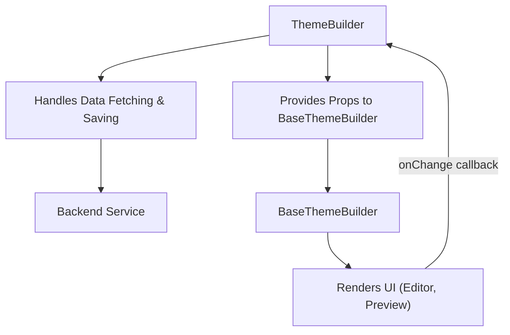

# Components

This section provides detailed documentation for the primary React components used in the Theme Builder library: `ThemeBuilder` and `BaseThemeBuilder`. Understanding their props and integration patterns is essential for effectively incorporating and extending the Theme Builder within your applications.

For information on how to access the theme state, refer to the [Hooks](./api-reference-hooks.md) section. For definitions of key data structures, see [Types](./api-reference-types.md).

## ThemeBuilder

The `ThemeBuilder` component serves as the high-level entry point for integrating the Material-UI Theme Builder into your application. It handles essential operations like fetching and saving theme data, providing a complete solution out of the box.

It wraps the `BaseThemeBuilder` component, adding functionalities such as asynchronous data loading and persistence. Use this component when you need a ready-to-use theme customization interface that interacts with your data storage.



### Props

| Name | Type | Description | Default Value |
|---|---|---|---|
| `loading` | `boolean` | Controls the visibility of a loading overlay over the component. | `false` |
| `showPreview` | `boolean` | Determines if the preview panel is displayed. | `false` |
| `showEditor` | `boolean` | Determines if the editor panel is displayed. | `true` |
| `showHeader` | `boolean` | Determines if the header (toolbar) is displayed. | `true` |
| `themeMode` | `Mode` | Sets the initial theme mode (`'light'` or `'dark'`). | `undefined` |
| `locale` | `Locale` | Sets the locale for component translations (e.g., `'en'`, `'zh'`). | `'en'` |
| `themeOptions` | `ThemeOptions` | Material-UI `ThemeOptions` to be deeply merged with the builder's default theme, allowing custom overrides. | `{}` |
| `themeData` | `ThemeData \| null` | Initial theme data to set. If provided, it overrides any data fetched by `fetchTheme`. | `undefined` |
| `children` | `React.ReactNode` | Allows you to override the default layout of the Theme Builder by providing custom children components. | `undefined` |
| `onSave` | `(themeData: ThemeData, defaultSave: DefaultSave) => Promise<void>` | Callback function invoked when the save button in the header is clicked. It receives the current `ThemeData` and a `defaultSave` utility function for backend persistence. | `undefined` |
| `onChange` | `(themeData: ThemeData) => void` | Callback function triggered whenever the theme data changes within the builder. | `undefined` |
| `fetchTheme` | `false \| ((defaultFetch: DefaultFetch) => Promise<ThemeData \| null>)` | Controls fetching of theme data from a backend. Set to `false` to disable fetching. Provide a function to customize the fetch logic, or leave `undefined` to use the default `getTheme` utility. | `undefined` |
| `onLoad` | `(themeData: ThemeData \| null) => void` | Callback function invoked after theme data has been loaded (or not loaded if `fetchTheme` is `false`). | `undefined` |

### Usage Example

This example demonstrates how to integrate `ThemeBuilder` into your application, enabling data loading and saving capabilities.

```tsx
import React from 'react';
import { ThemeBuilder, saveTheme, getTheme, ThemeData } from '@arcblock/theme-builder';

function App() {
  const handleSave = async (data: ThemeData, defaultSave: typeof saveTheme) => {
    // Implement your custom save logic here, or use defaultSave
    console.log('Saving theme data:', data);
    await defaultSave({ data });
  };

  const handleFetch = async (defaultFetch: typeof getTheme) => {
    // Implement your custom fetch logic here, or use defaultFetch
    console.log('Fetching theme data...');
    const data = await defaultFetch();
    console.log('Fetched theme data:', data);
    return data;
  };

  const handleChange = (data: ThemeData) => {
    console.log('Theme data changed:', data);
  };

  const handleLoad = (data: ThemeData | null) => {
    console.log('Theme data loaded:', data);
  };

  return (
    <div style={{ height: '100vh', width: '100vw' }}>
      <ThemeBuilder
        onSave={handleSave}
        fetchTheme={handleFetch}
        onChange={handleChange}
        onLoad={handleLoad}
        // You can pass other props to control UI visibility, locale, etc.
        showHeader={true}
        showEditor={true}
        showPreview={true}
      />
    </div>
  );
}

export default App;
```

This example sets up the `ThemeBuilder` to handle custom save and fetch operations, and logs theme data changes and load events. Using `defaultSave` and `defaultFetch` inside your handlers ensures you can extend the default behavior while leveraging the built-in utilities.

### Static Properties

The `ThemeBuilder` component exposes its internal sub-components as static properties, allowing for more granular control and composition if you choose not to use the default layout (e.g., when providing custom `children`).

*   `ThemeBuilder.Toolbar`: Refers to the `Header` component, typically containing save controls and preview size controls.
*   `ThemeBuilder.Editor`: Refers to the `Editor` component, where theme properties are visually edited.
*   `ThemeBuilder.Preview`: Refers to the `Preview` component, which displays a real-time preview of the customized theme.

## BaseThemeBuilder

The `BaseThemeBuilder` component provides the core UI layout and functionality for the Theme Builder without handling data persistence (fetching or saving theme data). It manages the internal state of the theme and renders the editor and preview interfaces.

Use this component if you need to integrate the Theme Builder's UI into an powerful application that already has its own theme data management layer, or if you want to implement custom data handling logic.

### Props

| Name | Type | Description | Default Value |
|---|---|---|---|
| `loading` | `boolean` | Controls the visibility of a loading overlay over the component. | `false` |
| `showPreview` | `boolean` | Determines if the preview panel is displayed. | `false` |
| `showEditor` | `boolean` | Determines if the editor panel is displayed. | `true` |
| `showHeader` | `boolean` | Determines if the header (toolbar) is displayed. | `true` |
| `themeMode` | `Mode` | Sets the initial theme mode (`'light'` or `'dark'`). | `undefined` |
| `locale` | `Locale` | Sets the locale for component translations (e.g., `'en'`, `'zh'`). | `'en'` |
| `themeOptions` | `ThemeOptions` | Material-UI `ThemeOptions` to be deeply merged with the builder's default theme, allowing custom overrides. | `{}` |
| `themeData` | `ThemeData \| null` | The theme data to be used by the builder. This prop directly controls the theme and is used to initialize the internal state. | `undefined` |
| `children` | `React.ReactNode` | Allows you to override the default layout of the Theme Builder by providing custom children components. | `undefined` |
| `onSave` | `(themeData: ThemeData) => Promise<void>` | Callback function invoked when the save button in the header is clicked. It receives the current `ThemeData`. | `undefined` |
| `onChange` | `(themeData: ThemeData) => void` | Callback function triggered whenever the theme data changes within the builder. | `undefined` |

### Usage Example

This example demonstrates how to use `BaseThemeBuilder` for a scenario where you manage theme data externally.

```tsx
import React, { useState, useEffect } from 'react';
import { BaseThemeBuilder, ThemeData } from '@arcblock/theme-builder';

// Imagine you fetch your initial theme data from an API
const fetchInitialThemeData = (): Promise<ThemeData | null> => {
  return Promise.resolve({
    concepts: {
      'default': {
        id: 'default',
        name: 'Default',
        mode: 'light',
        colors: { primary: { main: '#1976d2' } },
        // ... other theme properties
      }
    },
    currentConceptId: 'default'
  });
};

function MyCustomThemeManager() {
  const [currentThemeData, setCurrentThemeData] = useState<ThemeData | null>(null);
  const [loading, setLoading] = useState(true);

  useEffect(() => {
    fetchInitialThemeData().then(data => {
      setCurrentThemeData(data);
      setLoading(false);
    });
  }, []);

  const handleThemeChange = (newThemeData: ThemeData) => {
    console.log('Theme data updated by BaseThemeBuilder:', newThemeData);
    // You would typically save this newThemeData to your backend here
    setCurrentThemeData(newThemeData);
  };

  const handleSaveClick = async (themeDataToSave: ThemeData) => {
    console.log('Save button clicked in BaseThemeBuilder:', themeDataToSave);
    // Implement your save logic here
    // e.g., await myApi.saveTheme(themeDataToSave);
    alert('Theme data saved externally!');
  };

  if (loading) {
    return <div>Loading Theme Builder...</div>;
  }

  return (
    <div style={{ height: '100vh', width: '100vw' }}>
      <BaseThemeBuilder
        themeData={currentThemeData}
        onChange={handleThemeChange}
        onSave={handleSaveClick}
        showHeader={true}
        showEditor={true}
        showPreview={true}
        loading={false}
      />
    </div>
  );
}

export default MyCustomThemeManager;
```

This example shows how `BaseThemeBuilder` takes `themeData` as a prop and notifies changes via `onChange`, making it suitable for custom state management solutions.

---

This section provided a comprehensive overview of the `ThemeBuilder` and `BaseThemeBuilder` components, detailing their functionalities, available props, and integration patterns. You should now be able to choose the appropriate component for your application's needs and integrate it effectively. Continue to the [Hooks](./api-reference-hooks.md) section to learn how to access the theme store directly within your components.
