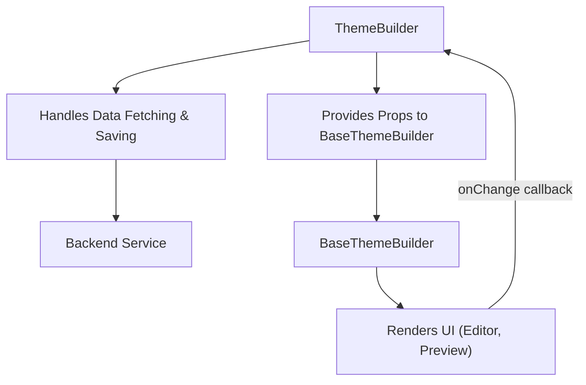

# 组件

本节提供了 Theme Builder 库中使用的主要 React 组件的详细文档：`ThemeBuilder` 和 `BaseThemeBuilder`。了解它们的属性和集成模式对于在应用程序中有效地集成和扩展 Theme Builder 至关重要。

有关如何访问主题状态的信息，请参阅[钩子](./api-reference-hooks.md)部分。有关关键数据结构的定义，请参阅[类型](./api-reference-types.md)。

## ThemeBuilder

`ThemeBuilder` 组件是用于将 Material-UI Theme Builder 集成到应用程序中的高层入口点。它处理诸如获取和保存主题数据等基本操作，提供了一个开箱即用的完整解决方案。

它包装了 `BaseThemeBuilder` 组件，添加了异步数据加载和持久化等功能。当您需要一个可直接使用并与数据存储交互的主题自定义界面时，请使用此组件。



### 属性

| 名称 | 类型 | 描述 | 默认值 |
|---|---|---|---|
| `loading` | `boolean` | 控制组件上方加载叠加层的可见性。 | `false` |
| `showPreview` | `boolean` | 确定是否显示预览面板。 | `false` |
| `showEditor` | `boolean` | 确定是否显示编辑器面板。 | `true` |
| `showHeader` | `boolean` | 确定是否显示头部（工具栏）。 | `true` |
| `themeMode` | `Mode` | 设置初始主题模式（`'light'` 或 `'dark'`）。 | `undefined` |
| `locale` | `Locale` | 设置组件翻译的区域设置（例如，`'en'`，`'zh'`）。 | `'en'` |
| `themeOptions` | `ThemeOptions` | Material-UI `ThemeOptions`，将与构建器的默认主题深度合并，允许自定义覆盖。 | `{}` |
| `themeData` | `ThemeData \| null` | 要设置的初始主题数据。如果提供，它将覆盖 `fetchTheme` 获取的任何数据。 | `undefined` |
| `children` | `React.ReactNode` | 通过提供自定义子组件，允许您覆盖 Theme Builder 的默认布局。 | `undefined` |
| `onSave` | `(themeData: ThemeData, defaultSave: DefaultSave) => Promise<void>` | 点击头部保存按钮时调用的回调函数。它接收当前 `ThemeData` 和一个用于后端持久化的 `defaultSave` 实用函数。 | `undefined` |
| `onChange` | `(themeData: ThemeData) => void` | 构建器内主题数据更改时触发的回调函数。 | `undefined` |
| `fetchTheme` | `false \| ((defaultFetch: DefaultFetch) => Promise<ThemeData \| null>)` | 控制从后端获取主题数据。设置为 `false` 禁用获取。提供一个函数以自定义获取逻辑，或留空 `undefined` 以使用默认的 `getTheme` 实用函数。 | `undefined` |
| `onLoad` | `(themeData: ThemeData \| null) => void` | 主题数据加载后（如果 `fetchTheme` 为 `false` 则未加载）调用的回调函数。 | `undefined` |

### 使用示例

此示例演示了如何将 `ThemeBuilder` 集成到您的应用程序中，从而启用数据加载和保存功能。

```tsx
import React from 'react';
import { ThemeBuilder, saveTheme, getTheme, ThemeData } from '@arcblock/theme-builder';

function App() {
  const handleSave = async (data: ThemeData, defaultSave: typeof saveTheme) => {
    // Implement your custom save logic here, or use defaultSave
    console.log('Saving theme data:', data);
    await defaultSave({ data });
  };

  const handleFetch = async (defaultFetch: typeof getTheme) => {
    // Implement your custom fetch logic here, or use defaultFetch
    console.log('Fetching theme data...');
    const data = await defaultFetch();
    console.log('Fetched theme data:', data);
    return data;
  };

  const handleChange = (data: ThemeData) => {
    console.log('Theme data changed:', data);
  };

  const handleLoad = (data: ThemeData | null) => {
    console.log('Theme data loaded:', data);
  };

  return (
    <div style={{ height: '100vh', width: '100vw' }}>
      <ThemeBuilder
        onSave={handleSave}
        fetchTheme={handleFetch}
        onChange={handleChange}
        onLoad={handleLoad}
        // You can pass other props to control UI visibility, locale, etc.
        showHeader={true}
        showEditor={true}
        showPreview={true}
      />
    </div>
  );
}

export default App;
```

此示例设置 `ThemeBuilder` 来处理自定义保存和获取操作，并记录主题数据更改和加载事件。在您的处理程序中使用 `defaultSave` 和 `defaultFetch` 可确保您在利用内置实用程序的同时扩展默认行为。

### 静态属性

`ThemeBuilder` 组件将其内部子组件作为静态属性公开，如果您选择不使用默认布局（例如，提供自定义 `children`），则可以进行更细粒度的控制和组合。

*   `ThemeBuilder.Toolbar`: 指的是 `Header` 组件，通常包含保存控件和预览大小控件。
*   `ThemeBuilder.Editor`: 指的是 `Editor` 组件，其中主题属性是可视化编辑的。
*   `ThemeBuilder.Preview`: 指的是 `Preview` 组件，它显示自定义主题的实时预览。

## BaseThemeBuilder

`BaseThemeBuilder` 组件提供了 Theme Builder 的核心 UI 布局和功能，但不处理数据持久化（获取或保存主题数据）。它管理主题的内部状态并渲染编辑器和预览界面。

如果您需要将 Theme Builder 的 UI 集成到已拥有自己的主题数据管理层的强大应用程序中，或者您想实现自定义数据处理逻辑，请使用此组件。

### 属性

| 名称 | 类型 | 描述 | 默认值 |
|---|---|---|---|
| `loading` | `boolean` | 控制组件上方加载叠加层的可见性。 | `false` |
| `showPreview` | `boolean` | 确定是否显示预览面板。 | `false` |
| `showEditor` | `boolean` | 确定是否显示编辑器面板。 | `true` |
| `showHeader` | `boolean` | 确定是否显示头部（工具栏）。 | `true` |
| `themeMode` | `Mode` | 设置初始主题模式（`'light'` 或 `'dark'`）。 | `undefined` |
| `locale` | `Locale` | 设置组件翻译的区域设置（例如，`'en'`，`'zh'`）。 | `'en'` |
| `themeOptions` | `ThemeOptions` | Material-UI `ThemeOptions`，将与构建器的默认主题深度合并，允许自定义覆盖。 | `{}` |
| `themeData` | `ThemeData \| null` | 要由构建器使用的主题数据。此属性直接控制主题并用于初始化内部状态。 | `undefined` |
| `children` | `React.ReactNode` | 通过提供自定义子组件，允许您覆盖 Theme Builder 的默认布局。 | `undefined` |
| `onSave` | `(themeData: ThemeData) => Promise<void>` | 点击头部保存按钮时调用的回调函数。它接收当前 `ThemeData`。 | `undefined` |
| `onChange` | `(themeData: ThemeData) => void` | 构建器内主题数据更改时触发的回调函数。 | `undefined` |

### 使用示例

此示例演示了如何使用 `BaseThemeBuilder` 处理您在外部管理主题数据的场景。

```tsx
import React, { useState, useEffect } from 'react';
import { BaseThemeBuilder, ThemeData } from '@arcblock/theme-builder';

// Imagine you fetch your initial theme data from an API
const fetchInitialThemeData = (): Promise<ThemeData | null> => {
  return Promise.resolve({
    concepts: {
      'default': {
        id: 'default',
        name: 'Default',
        mode: 'light',
        colors: { primary: { main: '#1976d2' } },
        // ... other theme properties
      }
    },
    currentConceptId: 'default'
  });
};

function MyCustomThemeManager() {
  const [currentThemeData, setCurrentThemeData] = useState<ThemeData | null>(null);
  const [loading, setLoading] = useState(true);

  useEffect(() => {
    fetchInitialThemeData().then(data => {
      setCurrentThemeData(data);
      setLoading(false);
    });
  }, []);

  const handleThemeChange = (newThemeData: ThemeData) => {
    console.log('Theme data updated by BaseThemeBuilder:', newThemeData);
    // You would typically save this newThemeData to your backend here
    setCurrentThemeData(newThemeData);
  };

  const handleSaveClick = async (themeDataToSave: ThemeData) => {
    console.log('Save button clicked in BaseThemeBuilder:', themeDataToSave);
    // Implement your save logic here
    // e.g., await myApi.saveTheme(themeDataToSave);
    alert('Theme data saved externally!');
  };

  if (loading) {
    return <div>Loading Theme Builder...</div>;
  }

  return (
    <div style={{ height: '100vh', width: '100vw' }}>
      <BaseThemeBuilder
        themeData={currentThemeData}
        onChange={handleThemeChange}
        onSave={handleSaveClick}
        showHeader={true}
        showEditor={true}
        showPreview={true}
        loading={false}
      />
    </div>
  );
}

export default MyCustomThemeManager;
```

此示例展示了 `BaseThemeBuilder` 如何接收 `themeData` 作为属性并通过 `onChange` 通知更改，使其适用于自定义状态管理解决方案。

---

本节全面概述了 `ThemeBuilder` 和 `BaseThemeBuilder` 组件，详细介绍了它们的功能、可用属性和集成模式。您现在应该能够根据应用程序的需求选择合适的组件并有效地集成它。继续阅读[钩子](./api-reference-hooks.md)部分，了解如何直接在组件中访问主题存储。
