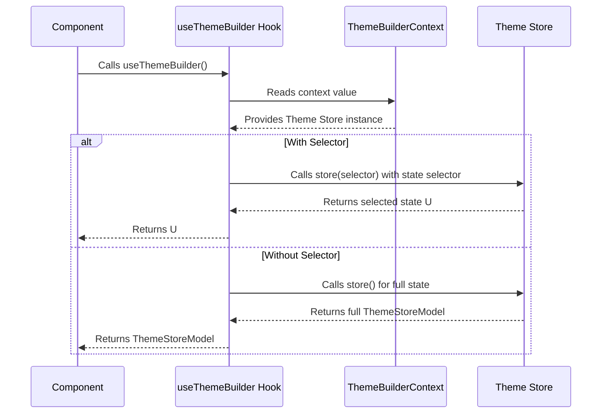

# Hooks

This section details the custom React hooks provided by the Theme Builder. These hooks offer convenient ways to interact with the component's internal state and functionalities, simplifying integration and customization. The primary hook discussed here is `useThemeBuilder`, which is crucial for accessing the theme store.

For a deeper understanding of the underlying state management system, refer to the [State Management](./core-concepts-state-management.md) section. To learn about the main components that provide this context, see [Components](./api-reference-components.md).

## useThemeBuilder

The `useThemeBuilder` hook provides access to the internal theme store, which manages all theme-related data and functionalities. This allows you to read the current theme state or subscribe to specific parts of it.

### Overview

The `useThemeBuilder` hook connects your components to the `ThemeBuilderContext`, provided by the `ThemeBuilder` or `BaseThemeBuilder` component. It allows you to retrieve the entire `ThemeStoreModel` or a specific slice of the state defined by a selector function.



### Parameters

The `useThemeBuilder` hook accepts an optional `selector` function.

| Name | Type | Description |
|---|---|---|
| `selector` | `(state: ThemeStoreModel) => U` | An optional function that receives the entire `ThemeStoreModel` and returns a specific part of the state. This is useful for optimizing re-renders by only subscribing to the state properties your component needs. |

### Returns

| Return Type | Description |
|---|---|
| `ThemeStoreModel` | If no `selector` function is provided, the hook returns the entire `ThemeStoreModel`, which contains all theme data and state management actions. |
| `U` | If a `selector` function is provided, the hook returns the specific value `U` derived from the `ThemeStoreModel` by the selector. |

### Usage Examples

#### Accessing the entire theme store

To get the full `ThemeStoreModel` object, call `useThemeBuilder` without any arguments. This provides access to all state properties and actions defined in the store.

```typescript
import { useThemeBuilder } from '@arcblock/ux/lib/ThemeBuilder';

function MyComponent() {
  const themeStore = useThemeBuilder();

  // Example: Get current concepts or call actions
  const concepts = themeStore.concepts;
  const currentConceptId = themeStore.currentConceptId;
  const getThemeData = themeStore.getThemeData;

  return (
    <div>
      <p>Current Concept ID: {currentConceptId}</p>
      {/* Render theme data using themeStore */}
    </div>
  );
}
```

#### Selecting specific parts of the state

To optimize performance and avoid unnecessary re-renders, you can provide a selector function to `useThemeBuilder`. This function will receive the `ThemeStoreModel` and should return only the specific part of the state your component needs.

```typescript
import { useThemeBuilder } from '@arcblock/ux/lib/ThemeBuilder';
import { shallow } from 'zustand/shallow';

function ThemeModeDisplay() {
  // Selects only the 'themeMode' and 'themePrefer' properties
  const { themeMode, themePrefer } = useThemeBuilder(
    (state) => ({ themeMode: state.themeMode, themePrefer: state.themePrefer }),
    shallow // Use shallow comparison for object selectors to prevent re-renders
  );

  return (
    <div>
      <p>Current Theme Mode: {themeMode}</p>
      <p>Theme Preference: {themePrefer}</p>
    </div>
  );
}

function CurrentConceptName() {
  // Selects only the current concept's name based on currentConceptId
  const currentConceptName = useThemeBuilder((state) => {
    const currentConcept = state.concepts.find(c => c.id === state.currentConceptId);
    return currentConcept ? currentConcept.name : 'N/A';
  });

  return (
    <div>
      <p>Active Concept: {currentConceptName}</p>
    </div>
  );
}
```

When using a selector that returns an object, array, or other non-primitive value, consider using a comparison function (like `zustand/shallow`) as the second argument to `useThemeBuilder` (which internally uses Zustand's `subscribe` mechanism). This prevents re-renders if the selected data's values are the same, even if the reference changes.

### Error Handling

The `useThemeBuilder` hook must be used within a component wrapped by the `<ThemeBuilder>` or `<BaseThemeBuilder>` component. If it's called outside of this context, it will throw an error:

```
Error: useThemeBuilder must be used within <ThemeBuilder>
```

This ensures that the hook always has access to the necessary theme store instance.

---

This section provided a detailed look at the `useThemeBuilder` hook, an essential tool for interacting with the Theme Builder's state. You now understand how to access and subscribe to theme data. To explore the various data structures and interfaces used throughout the Theme Builder, proceed to the [Types](./api-reference-types.md) section.