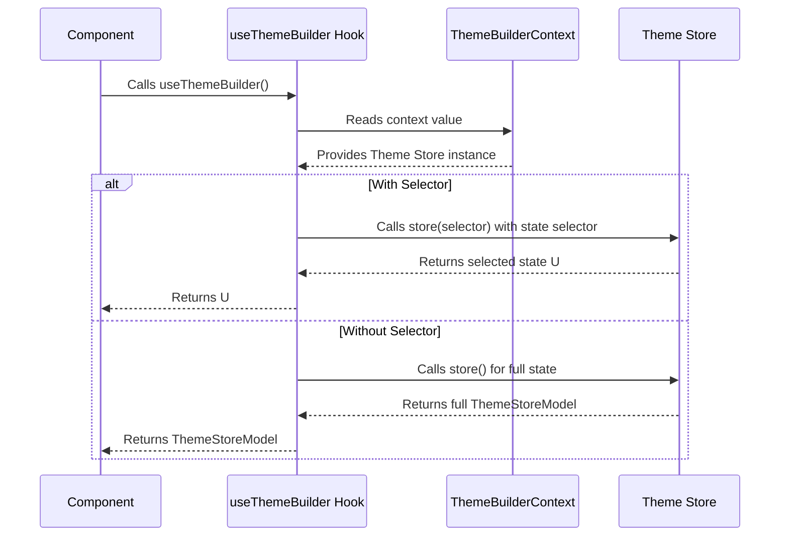

# Hooks

本节详细介绍了 Theme Builder 提供的自定义 React Hook。这些 Hook 提供了与组件内部状态和功能进行交互的便捷方式，从而简化了集成和定制。此处讨论的主要 Hook 是 `useThemeBuilder`，它对于访问主题存储至关重要。

有关底层状态管理系统的更深入理解，请参阅[状态管理](./core-concepts-state-management.md)部分。要了解提供此上下文的主要组件，请参阅[组件](./api-reference-components.md)。

## useThemeBuilder

`useThemeBuilder` Hook 提供对内部主题存储的访问，该存储管理所有与主题相关的数据和功能。这使您能够读取当前主题状态或订阅其特定部分。

### 概述

`useThemeBuilder` Hook 将您的组件连接到由 `ThemeBuilder` 或 `BaseThemeBuilder` 组件提供的 `ThemeBuilderContext`。它允许您检索整个 `ThemeStoreModel` 或由选择器函数定义的特定状态切片。



### 参数

`useThemeBuilder` Hook 接受一个可选的 `selector` 函数。

| 名称 | 类型 | 描述 |
|---|---|---|
| `selector` | `(state: ThemeStoreModel) => U` | 一个可选函数，它接收整个 `ThemeStoreModel` 并返回状态的特定部分。这对于仅订阅组件所需的状态属性来优化重新渲染非常有用。 |

### 返回值

| 返回类型 | 描述 |
|---|---|
| `ThemeStoreModel` | 如果未提供 `selector` 函数，则 Hook 返回整个 `ThemeStoreModel`，其中包含所有主题数据和状态管理操作。 |
| `U` | 如果提供了 `selector` 函数，则 Hook 返回由选择器从 `ThemeStoreModel` 派生的特定值 `U`。 |

### 使用示例

#### 访问整个主题存储

要获取完整的 `ThemeStoreModel` 对象，请不带任何参数调用 `useThemeBuilder`。这提供了对存储中定义的所有状态属性和操作的访问。

```typescript
import { useThemeBuilder } from '@arcblock/ux/lib/ThemeBuilder';

function MyComponent() {
  const themeStore = useThemeBuilder();

  // Example: Get current concepts or call actions
  const concepts = themeStore.concepts;
  const currentConceptId = themeStore.currentConceptId;
  const getThemeData = themeStore.getThemeData;

  return (
    <div>
      <p>Current Concept ID: {currentConceptId}</p>
      {/* Render theme data using themeStore */}
    </div>
  );
}
```

#### 选择状态的特定部分

为了优化性能并避免不必要的重新渲染，您可以向 `useThemeBuilder` 提供一个选择器函数。此函数将接收 `ThemeStoreModel`，并且应仅返回组件所需的状态的特定部分。

```typescript
import { useThemeBuilder } from '@arcblock/ux/lib/ThemeBuilder';
import { shallow } from 'zustand/shallow';

function ThemeModeDisplay() {
  // Selects only the 'themeMode' and 'themePrefer' properties
  const { themeMode, themePrefer } = useThemeBuilder(
    (state) => ({ themeMode: state.themeMode, themePrefer: state.themePrefer }),
    shallow // Use shallow comparison for object selectors to prevent re-renders
  );

  return (
    <div>
      <p>Current Theme Mode: {themeMode}</p>
      <p>Theme Preference: {themePrefer}</p>
    </div>
  );
}

function CurrentConceptName() {
  // Selects only the current concept's name based on currentConceptId
  const currentConceptName = useThemeBuilder((state) => {
    const currentConcept = state.concepts.find(c => c.id === state.currentConceptId);
    return currentConcept ? currentConcept.name : 'N/A';
  });

  return (
    <div>
      <p>Active Concept: {currentConceptName}</p>
    </div>
  );
}
```

当使用返回对象、数组或其他非原始值的选择器时，请考虑使用比较函数（例如 `zustand/shallow`）作为 `useThemeBuilder` 的第二个参数（它内部使用 Zustand 的 `subscribe` 机制）。这可以防止在选择的数据值相同（即使引用发生变化）时进行重新渲染。

### 错误处理

`useThemeBuilder` Hook 必须在 `<ThemeBuilder>` 或 `<BaseThemeBuilder>` 组件包装的组件内使用。如果在此上下文之外调用，它将抛出错误：

```
Error: useThemeBuilder must be used within <ThemeBuilder>
```

这确保了 Hook 始终可以访问必要的主题存储实例。

---

本节详细介绍了 `useThemeBuilder` Hook，它是与 Theme Builder 状态交互的重要工具。您现在已了解如何访问和订阅主题数据。要探索 Theme Builder 中使用的各种数据结构和接口，请继续阅读[类型](./api-reference-types.md)部分。
