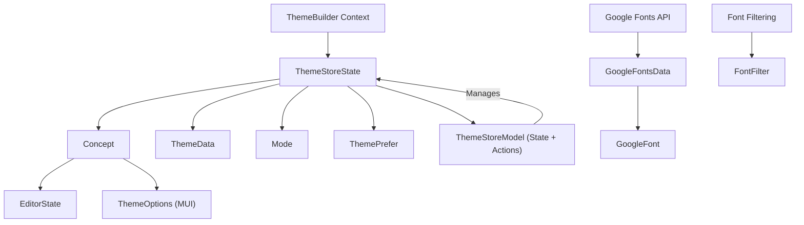

# Types

This section provides detailed definitions for the key data structures and interfaces used within the Theme Builder. Understanding these types is crucial for effectively integrating and extending the component's functionalities. For information on the core React components, refer to [Components](./api-reference-components.md), and for custom hooks, see [Hooks](./api-reference-hooks.md).

Below is a diagram illustrating the relationships between some of the core data types:



## Basic Types

These are fundamental literal types (enums) used throughout the Theme Builder to define specific states or categories.

### `Mode`

Represents the current theme color mode.

```typescript
type Mode = 'light' | 'dark';
```

### `ThemePrefer`

Defines the user's preferred theme mode, including a system-wide preference.

```typescript
type ThemePrefer = 'light' | 'dark' | 'system';
```

### `TextVariant`

Specifies the supported text style variants for typography.

```typescript
type TextVariant = 'heading' | 'body';
```

### `PreviewSize`

Defines the available sizes for the preview window in the Theme Builder.

```typescript
type PreviewSize = 'xs' | 'sm' | 'md' | 'lg' | 'xl' | false;
```

### `MainColors`

Represents the primary color keys used in a Material-UI theme palette.

```typescript
type MainColors = 'primary' | 'secondary' | 'success' | 'error' | 'info' | 'warning';
```

## Core Data Models

These interfaces define the main data structures for managing themes and their configurations.

### `Concept`

Represents a single customizable theme concept, including its name, mode, and configuration options.

| Name | Type | Description |
|---|---|---| 
| `id` | `string` | Unique identifier for the concept. |
| `name` | `string` | Display name of the theme concept. |
| `template` | `string` | Name of the predefined template used for this concept. |
| `mode` | `Mode` | Current active color mode (`'light'` or `'dark'`). |
| `prefer` | `ThemePrefer` | User's preferred theme mode (`'light'`, `'dark'`, or `'system'`). |
| `themeConfig` | `{ light: ThemeOptions; dark: ThemeOptions; common: ThemeOptions; }` | Material-UI `ThemeOptions` for light, dark, and common configurations. |
| `editor` | `EditorState` | State of the editor for locked properties. |

### `ThemeData`

The top-level data structure holding all theme concepts and the currently active concept.

| Name | Type | Description |
|---|---|---| 
| `concepts` | `Concept[]` | An array of all managed theme concepts. |
| `currentConceptId` | `string` | The ID of the currently active theme concept. |

### `PredefinedTheme`

Defines the structure for a pre-configured theme that can be applied to a concept.

| Name | Type | Description |
|---|---|---| 
| `name` | `string` | Name of the predefined theme. |
| `light` | `Record<MainColors, string>` | Main colors for the light mode. |
| `dark` | `Record<MainColors, string>` | Main colors for the dark mode. |
| `fonts` | `Partial<Record<TextVariant, { fontFamily: string }>>` | Font family settings for different text variants. |

### `EditorState`

Tracks which theme properties (colors, typography, styles) are locked in the editor, preventing them from being randomized or changed by certain operations.

| Name | Type | Description |
|---|---|---| 
| `colors` | `{ [key: string]: { isLocked: boolean; }; }` | Lock status for individual color keys. |
| `typography` | `{ [key: string]: { isLocked: boolean; }; }` | Lock status for typography variants. |
| `styles` | `{ [key: string]: { isLocked: boolean; }; }` | Lock status for general styles. |

## Theme Store Types

These types relate to the internal state management of the Theme Builder using Zustand.

### `ThemeStoreState`

Represents the core state managed by the Theme Builder's Zustand store.

| Name | Type | Description |
|---|---|---| 
| `concepts` | `Concept[]` | All theme concepts in the store. |
| `currentConceptId` | `string` | ID of the currently active concept. |
| `loadedFonts` | `Set<string>` | A set of font families that have been loaded. |
| `previewSize` | `PreviewSize` | Current size of the preview window. |
| `selectedComponentId` | `string` | ID of the currently selected component in the preview. |
| `themeObject` | `Theme` | The Material-UI theme object derived from the current concept. |
| `saving` | `boolean` | Indicates if the theme data is currently being saved. |
| `themeMode?` | `Mode` | Optional explicit theme mode for the builder. |
| `history` | `{ concepts: Concept[]; currentConceptId: string; }[]` | Array representing the history stack for undo/redo. |
| `currentHistoryIndex` | `number` | Current position in the history stack. |
| `maxHistorySize` | `number` | Maximum number of history states to retain. |

### `ThemeStoreModel`

This interface extends `ThemeStoreState` by adding all the actions and methods available on the Theme Builder's store. It represents the complete API for interacting with and modifying the theme state.

```typescript
interface ThemeStoreModel extends ThemeStoreState { /* ... methods ... */ }
```

### `ApplyThemeOptions`

Options that can be passed when applying a predefined theme or colors/typography to a concept.

| Name | Type | Description |
|---|---|---| 
| `colorKeys?` | `string` &#124; `string[]` | Specific color keys to apply or shuffle. |
| `textVariants?` | `TextVariant` &#124; `TextVariant[]` | Specific text variants to apply or shuffle. |
| `skipCheckLock?` | `boolean` | If `true`, skips checking for locked properties during application. |

## Font-Related Types

These types are specifically for handling Google Fonts data and filtering options.

### `GoogleFont`

Represents a single entry for a Google Font.

| Name | Type | Description |
|---|---|---| 
| `f` | `string` | Font family name. |
| `c` | `string` | Font category (e.g., 'sans-serif', 'serif'). |
| `p` | `number` | Popularity score of the font. |

### `GoogleFontsData`

The complete dataset structure for all Google Fonts available.

| Name | Type | Description |
|---|---|---| 
| `t` | `number` | Total count of fonts in the dataset. |
| `all` | `GoogleFont[]` | An array containing all available Google Font entries. |

### `FontFilter`

Defines the criteria for filtering Google Fonts.

| Name | Type | Description |
|---|---|---| 
| `category?` | `string` | Optional filter by font category. |
| `searchQuery?` | `string` | Optional search query to filter fonts by name. |

---

Understanding these types is essential for advanced usage and extending the Theme Builder. You can now proceed to explore the [Utilities](./api-reference-utilities.md) that support theme manipulation and data handling.