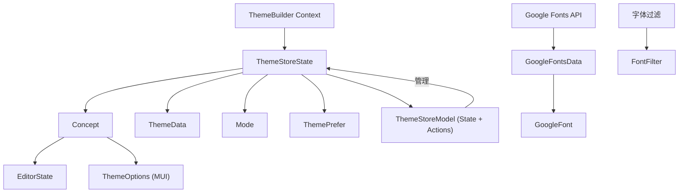

# 类型

本节详细定义了 Theme Builder 中使用的关键数据结构和接口。理解这些类型对于有效集成和扩展组件功能至关重要。有关核心 React 组件的信息，请参阅 [Components](./api-reference-components.md)，有关自定义 Hook 的信息，请参阅 [Hooks](./api-reference-hooks.md)。

下面是一个图表，说明了部分核心数据类型之间的关系：



## 基本类型

这些是 Theme Builder 中使用的基本字面量类型（枚举），用于定义特定的状态或类别。

### `Mode`

表示当前主题颜色模式。

```typescript
type Mode = 'light' | 'dark';
```

### `ThemePrefer`

定义用户的首选主题模式，包括系统范围的偏好设置。

```typescript
type ThemePrefer = 'light' | 'dark' | 'system';
```

### `TextVariant`

指定排版支持的文本样式变体。

```typescript
type TextVariant = 'heading' | 'body';
```

### `PreviewSize`

定义 Theme Builder 中预览窗口的可用尺寸。

```typescript
type PreviewSize = 'xs' | 'sm' | 'md' | 'lg' | 'xl' | false;
```

### `MainColors`

表示 Material-UI 主题调色板中使用的主要颜色键。

```typescript
type MainColors = 'primary' | 'secondary' | 'success' | 'error' | 'info' | 'warning';
```

## 核心数据模型

这些接口定义了用于管理主题及其配置的主要数据结构。

### `Concept`

表示一个可自定义的主题概念，包括其名称、模式和配置选项。

| Name | Type | Description |
|---|---|---|
| `id` | `string` | 概念的唯一标识符。 |
| `name` | `string` | 主题概念的显示名称。 |
| `template` | `string` | 此概念使用的预定义模板的名称。 |
| `mode` | `Mode` | 当前活动颜色模式（`'light'` 或 `'dark'`）。 |
| `prefer` | `ThemePrefer` | 用户首选主题模式（`'light'`、`'dark'` 或 `'system'`）。 |
| `themeConfig` | `{ light: ThemeOptions; dark: ThemeOptions; common: ThemeOptions; }` | 用于浅色、深色和通用配置的 Material-UI `ThemeOptions`。 |
| `editor` | `EditorState` | 编辑器中锁定属性的状态。 |

### `ThemeData`

包含所有主题概念和当前活动概念的顶级数据结构。

| Name | Type | Description |
|---|---|---|
| `concepts` | `Concept[]` | 所有管理的主题概念数组。 |
| `currentConceptId` | `string` | 当前活动主题概念的 ID。 |

### `PredefinedTheme`

定义可应用于概念的预配置主题的结构。

| Name | Type | Description |
|---|---|---|
| `name` | `string` | 预定义主题的名称。 |
| `light` | `Record<MainColors, string>` | 浅色模式的主要颜色。 |
| `dark` | `Record<MainColors, string>` | 深色模式的主要颜色。 |
| `fonts` | `Partial<Record<TextVariant, { fontFamily: string }>>` | 不同文本变体的字体系列设置。 |

### `EditorState`

跟踪编辑器中锁定的主题属性（颜色、排版、样式），防止它们被随机化或被某些操作更改。

| Name | Type | Description |
|---|---|---|
| `colors` | `{ [key: string]: { isLocked: boolean; }; }` | 各个颜色键的锁定状态。 |
| `typography` | `{ [key: string]: { isLocked: boolean; }; }` | 排版变体的锁定状态。 |
| `styles` | `{ [key: string]: { isLocked: boolean; }; }` | 通用样式的锁定状态。 |

## 主题存储类型

这些类型与 Theme Builder 使用 Zustand 进行的内部状态管理有关。

### `ThemeStoreState`

表示 Theme Builder 的 Zustand 存储管理的核心状态。

| Name | Type | Description |
|---|---|---|
| `concepts` | `Concept[]` | 存储中的所有主题概念。 |
| `currentConceptId` | `string` | 当前活动概念的 ID。 |
| `loadedFonts` | `Set<string>` | 已加载的字体系列集合。 |
| `previewSize` | `PreviewSize` | 预览窗口的当前尺寸。 |
| `selectedComponentId` | `string` | 预览中当前选定组件的 ID。 |
| `themeObject` | `Theme` | 从当前概念派生出的 Material-UI 主题对象。 |
| `saving` | `boolean` | 指示主题数据当前是否正在保存。 |
| `themeMode?` | `Mode` | 构建器的可选显式主题模式。 |
| `history` | `{ concepts: Concept[]; currentConceptId: string; }[]` | 表示用于撤消/重做操作的历史堆栈的数组。 |
| `currentHistoryIndex` | `number` | 在历史堆栈中的当前位置。 |
| `maxHistorySize` | `number` | 要保留的最大历史状态数。 |

### `ThemeStoreModel`

此接口通过添加 Theme Builder 存储上可用的所有行为和方法来扩展 `ThemeStoreState`。它表示用于与主题状态交互和修改主题状态的完整 API。

```typescript
interface ThemeStoreModel extends ThemeStoreState { /* ... methods ... */ }
```

### `ApplyThemeOptions`

在将预定义主题或颜色/排版应用于概念时可传递的选项。

| Name | Type | Description |
|---|---|---|
| `colorKeys?` | `string` &#124; `string[]` | 要应用或打乱的特定颜色键。 |
| `textVariants?` | `TextVariant` &#124; `TextVariant[]` | 要应用或打乱的特定文本变体。 |
| `skipCheckLock?` | `boolean` | 如果为 `true`，则在应用期间跳过检查锁定属性。 |

## 字体相关类型

这些类型专门用于处理 Google Fonts 数据和筛选选项。

### `GoogleFont`

表示 Google 字体的一个条目。

| Name | Type | Description |
|---|---|---|
| `f` | `string` | 字体系列名称。 |
| `c` | `string` | 字体类别（例如，'sans-serif'，'serif'）。 |
| `p` | `number` | 字体的流行度得分。 |

### `GoogleFontsData`

所有可用 Google Fonts 的完整数据集结构。

| Name | Type | Description |
|---|---|---|
| `t` | `number` | 数据集中字体的总数。 |
| `all` | `GoogleFont[]` | 包含所有可用 Google 字体条目的数组。 |

### `FontFilter`

定义筛选 Google Fonts 的条件。

| Name | Type | Description |
|---|---|---|
| `category?` | `string` | 可选的字体类别筛选。 |
| `searchQuery?` | `string` | 可选的搜索查询，用于按名称筛选字体。 |

---

理解这些类型对于 Theme Builder 的高级用法和扩展至关重要。您现在可以继续探索支持主题操作和数据处理的 [Utilities](./api-reference-utilities.md)。