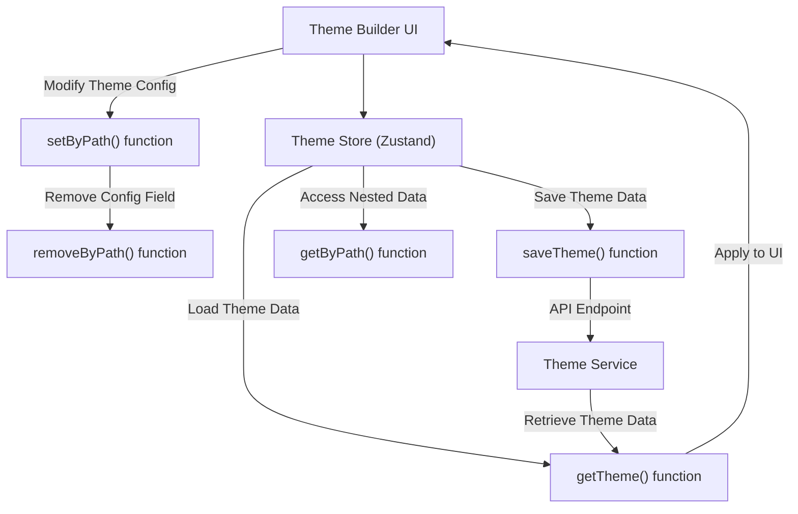

# Utilities

This section provides a reference for various utility functions that simplify theme manipulation and data handling within the Theme Builder. These functions are crucial for programmatically interacting with theme data, saving and loading configurations, and managing nested object structures efficiently.

For an understanding of the overall architecture and how these utilities fit into the state management, refer to the [State Management](./core-concepts-state-management.md) section. For details on the data models these utilities operate on, see [Theme Concepts](./core-concepts-theme-concepts.md) and [Theme Options Structure](./core-concepts-theme-options-structure.md).



## saveTheme

The `saveTheme` function allows you to persist your theme configurations to the backend service. It sends a POST request to the theme endpoint, enabling you to save changes made in the Theme Builder.

**Parameters**

| Name | Type | Description |
|---|---|---|
| `url` | `string` | Optional. The URL of the theme endpoint. If not provided, the default endpoint is used. |
| `data` | `ThemeData` | The theme data object to be saved. This typically includes `light`, `dark`, and `common` theme configurations. |
| `config` | `AxiosRequestConfig` | Optional. Additional Axios request configurations, such as headers or timeouts. |

**Returns**

| Name | Type | Description |
|---|---|---|
| `Promise` | `Promise<AxiosResponse>` | A promise that resolves with the Axios response object upon successful saving, or rejects on error. |

**Example**

```javascript
import { saveTheme } from '@blocklet/react';

async function saveMyTheme(themeData) {
  try {
    const response = await saveTheme({
      data: themeData,
      config: { headers: { 'X-Custom-Header': 'ThemeBuilder' } },
    });
    console.log('Theme saved successfully:', response.status);
  } catch (error) {
    console.error('Error saving theme:', error.message);
  }
}

// Example themeData structure
const myThemeData = {
  light: { palette: { primary: { main: '#1976d2' } } },
  dark: { palette: { primary: { main: '#90caf9' } } },
  common: { typography: { fontFamily: 'Roboto' } },
};
saveMyTheme(myThemeData);
```

**Example Response**
```json
{
  "status": 200,
  "data": {
    "message": "Theme saved successfully"
  }
}
```

This example demonstrates how to save a `themeData` object to the service endpoint, including an optional custom header.

## getTheme

The `getTheme` function retrieves the current theme configuration from the backend service. It handles compatibility with older data formats, ensuring that the returned `concepts` and `currentConceptId` are always in the expected structure.

**Parameters**

| Name | Type | Description |
|---|---|---|
| `url` | `string` | Optional. The URL of the theme endpoint. If not provided, the default endpoint is used. |
| `config` | `AxiosRequestConfig` | Optional. Additional Axios request configurations. |

**Returns**

| Name | Type | Description |
|---|---|---|
| `Promise` | `Promise<{ concepts: Concept[], currentConceptId: string }>` | A promise that resolves with an object containing an array of `Concept` objects and the `currentConceptId`. |

**Example**

```javascript
import { getTheme } from '@blocklet/react';

async function loadMyTheme() {
  try {
    const { concepts, currentConceptId } = await getTheme();
    console.log('Loaded Concepts:', concepts);
    console.log('Current Concept ID:', currentConceptId);
    // You can then find the current concept and its themeConfig
    const currentConcept = concepts.find(c => c.id === currentConceptId);
    console.log('Current Theme Config:', currentConcept?.themeConfig);
  } catch (error) {
    console.error('Error loading theme:', error.message);
  }
}

loadMyTheme();
```

**Example Response**
```json
{
  "concepts": [
    {
      "id": "default-concept",
      "name": "Default Concept",
      "template": "Default Concept",
      "mode": "light",
      "prefer": "system",
      "themeConfig": {
        "light": {
          "palette": {
            "primary": {
              "main": "#1976d2"
            }
          }
        },
        "dark": {
          "palette": {
            "primary": {
              "main": "#90caf9"
            }
          }
        },
        "common": {
          "typography": {
            "fontFamily": "Roboto"
          }
        }
      },
      "editor": {
        "colors": {},
        "typography": {},
        "styles": {}
      }
    }
  ],
  "currentConceptId": "default-concept"
}
```

This example fetches the theme data from the service, logs the retrieved concepts and the currently active concept ID, and then accesses its configuration.

## setByPath

The `setByPath` function allows you to set a nested value within an object using a string path. This is particularly useful for modifying specific properties deep within the Material-UI `ThemeOptions` structure without extensive boilerplate.

**Parameters**

| Name | Type | Description |
|---|---|---|
| `object` | `any` | The target object to modify. |
| `path` | `string` | The string path to the property to set (e.g., `'palette.primary.main'`). |
| `value` | `any` | The value to set at the specified path. |

**Returns**

| Name | Type | Description |
|---|---|---|
| `result` | `any` | The new object with the value set at the specified path. The original object is not mutated directly; a new object is returned. |

**Example**

```javascript
import { setByPath } from '@blocklet/react';

const initialTheme = {
  palette: {
    primary: { main: '#000000' },
    secondary: { main: '#FFFFFF' },
  },
  typography: { fontFamily: 'Arial' },
};

// Set a new primary color
const updatedTheme1 = setByPath(initialTheme, 'palette.primary.main', '#1976d2');
console.log('Updated primary color:', updatedTheme1.palette.primary.main);

// Add a new property
const updatedTheme2 = setByPath(updatedTheme1, 'spacing', 8);
console.log('Added spacing:', updatedTheme2.spacing);

// Set a nested object
const updatedTheme3 = setByPath(updatedTheme2, 'components.MuiButton', { defaultProps: { disableElevation: true } });
console.log('Set MuiButton defaultProps:', updatedTheme3.components.MuiButton);
```

**Example Response (console output)**
```
Updated primary color: #1976d2
Added spacing: 8
Set MuiButton defaultProps: { defaultProps: { disableElevation: true } }
```

This example demonstrates setting various values, including a new primary color, adding a spacing property, and defining component default props using a path.

## removeByPath

The `removeByPath` function deletes a nested property from an object using a string path. A key feature is its ability to also remove empty parent objects that result from the deletion, keeping the object structure clean.

**Parameters**

| Name | Type | Description |
|---|---|---|
| `object` | `any` | The target object to modify. |
| `path` | `string` | The string path to the property to remove (e.g., `'palette.primary'`). |

**Returns**

| Name | Type | Description |
|---|---|---|
| `result` | `any` | The new object with the property removed. The original object is not mutated directly; a new object is returned. |

**Example**

```javascript
import { removeByPath } from '@blocklet/react';

const initialTheme = {
  palette: {
    primary: { main: '#1976d2', light: '#42a5f5' },
    secondary: { main: '#FFFFFF' },
  },
  typography: { fontFamily: 'Roboto' },
};

// Remove a specific color variant
const themeAfterRemoval1 = removeByPath(initialTheme, 'palette.primary.light');
console.log('After removing primary.light:', themeAfterRemoval1.palette.primary);

// Remove an entire palette (and potentially its parent if it becomes empty)
const themeAfterRemoval2 = removeByPath(themeAfterRemoval1, 'palette.secondary');
console.log('After removing secondary palette:', themeAfterRemoval2.palette);

// If palette becomes empty, it will also be removed, leaving only typography and potentially others
const themeAfterRemoval3 = removeByPath(themeAfterRemoval2, 'palette.primary');
console.log('After removing primary palette (and potentially empty parent):', themeAfterRemoval3.palette);
```

**Example Response (console output)**
```
After removing primary.light: { main: '#1976d2' }
After removing secondary palette: { primary: { main: '#1976d2' } }
After removing primary palette (and potentially empty parent): undefined
```

This example illustrates how to remove nested properties, including how `removeByPath` cleans up empty parent objects created by the deletion, leading to a more compact theme configuration.

## getByPath

The `getByPath` function retrieves a nested value from an object using a string path. This is a safe way to access deeply nested properties, providing a default value if the path does not exist, preventing errors from accessing `undefined` properties.

**Parameters**

| Name | Type | Description |
|---|---|---|
| `object` | `object` | The object from which to retrieve the value. |
| `path` | `string` | The string path to the desired property (e.g., `'palette.primary.main'`). |
| `defaultValue` | `any` | Optional. The value to return if the path is not found or the intermediate objects are null/undefined. |

**Returns**

| Name | Type | Description |
|---|---|---|
| `value` | `any` | The value at the specified path, or the `defaultValue` if the path is invalid or the property is not found. |

**Example**

```javascript
import { getByPath } from '@blocklet/react';

const themeConfig = {
  palette: {
    primary: { main: '#1976d2', contrastText: '#FFFFFF' },
    secondary: { main: '#dc004e' },
  },
  typography: {
    fontFamily: 'Roboto',
    h1: { fontSize: '2rem' },
  },
  spacing: 8,
};

// Retrieve an existing value
const primaryMainColor = getByPath(themeConfig, 'palette.primary.main');
console.log('Primary Main Color:', primaryMainColor);

// Retrieve a non-existent value with a default
const tertiaryColor = getByPath(themeConfig, 'palette.tertiary.main', '#CCCCCC');
console.log('Tertiary Main Color (default):', tertiaryColor);

// Retrieve a non-existent value without a default
const nonexistentFont = getByPath(themeConfig, 'typography.h2.fontFamily');
console.log('Non-existent H2 Font Family:', nonexistentFont);

// Retrieve a top-level property
const spacingValue = getByPath(themeConfig, 'spacing');
console.log('Spacing Value:', spacingValue);
```

**Example Response (console output)**
```
Primary Main Color: #1976d2
Tertiary Main Color (default): #CCCCCC
Non-existent H2 Font Family: undefined
Spacing Value: 8
```

This example demonstrates how to safely retrieve values from deeply nested objects using string paths and the utility of providing a default value for missing properties.

---

This section provided a detailed overview of essential utility functions for theme management and data manipulation. These functions facilitate direct interaction with theme configurations, making it easier to manage complex object structures. For more details on the main components and hooks that utilize these utilities, refer to the main [API Reference](./api-reference.md) documentation.