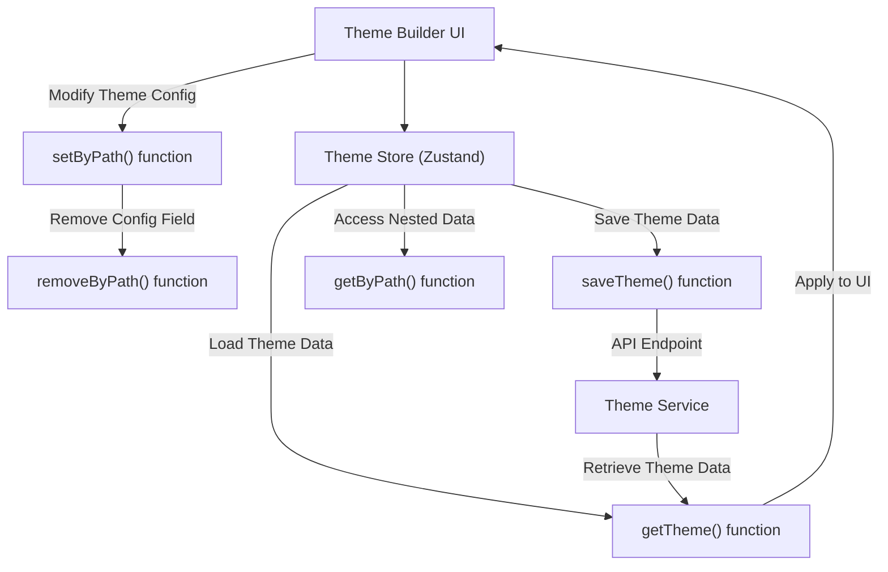

# 实用工具

本节提供了各种实用工具函数的参考，这些函数简化了 Theme Builder 中的主题操作和数据处理。这些函数对于以编程方式与主题数据交互、保存和加载配置以及高效管理嵌套对象结构至关重要。

要了解整体架构以及这些实用工具如何融入状态管理，请参阅[状态管理](./core-concepts-state-management.md)部分。有关这些实用工具所操作的数据模型的详细信息，请参阅[主题概念](./core-concepts-theme-concepts.md)和[主题选项结构](./core-concepts-theme-options-structure.md)。



## saveTheme

`saveTheme` 函数允许您将主题配置持久化到后端服务。它向主题端点发送 POST 请求，使您能够保存 Theme Builder 中所做的更改。

**参数**

| 名称 | 类型 | 描述 |
|---|---|---|
| `url` | `string` | 可选。主题端点的 URL。如果未提供，则使用默认端点。 |
| `data` | `ThemeData` | 要保存的主题数据对象。这通常包括 `light`、`dark` 和 `common` 主题配置。 |
| `config` | `AxiosRequestConfig` | 可选。额外的 Axios 请求配置，例如标头或超时。 |

**返回值**

| 名称 | 类型 | 描述 |
|---|---|---|
| `Promise` | `Promise<AxiosResponse>` | 一个 Promise，在成功保存时解析为 Axios 响应对象，或在出错时拒绝。 |

**示例**

```javascript
import { saveTheme } from '@blocklet/react';

async function saveMyTheme(themeData) {
  try {
    const response = await saveTheme({
      data: themeData,
      config: { headers: { 'X-Custom-Header': 'ThemeBuilder' } },
    });
    console.log('Theme saved successfully:', response.status);
  } catch (error) {
    console.error('Error saving theme:', error.message);
  }
}

// Example themeData structure
const myThemeData = {
  light: { palette: { primary: { main: '#1976d2' } } },
  dark: { palette: { primary: { main: '#90caf9' } } },
  common: { typography: { fontFamily: 'Roboto' } },
};
saveMyTheme(myThemeData);
```

**示例响应**
```json
{
  "status": 200,
  "data": {
    "message": "Theme saved successfully"
  }
}
```

此示例演示了如何将 `themeData` 对象保存到服务端点，包括一个可选的自定义标头。

## getTheme

`getTheme` 函数从后端服务检索当前主题配置。它处理与旧数据格式的兼容性，确保返回的 `concepts` 和 `currentConceptId` 始终采用预期的结构。

**参数**

| 名称 | 类型 | 描述 |
|---|---|---|
| `url` | `string` | 可选。主题端点的 URL。如果未提供，则使用默认端点。 |
| `config` | `AxiosRequestConfig` | 可选。额外的 Axios 请求配置。 |

**返回值**

| 名称 | 类型 | 描述 |
|---|---|---|
| `Promise` | `Promise<{ concepts: Concept[], currentConceptId: string }>` | 一个 Promise，解析为一个包含 `Concept` 对象数组和 `currentConceptId` 的对象。 |

**示例**

```javascript
import { getTheme } from '@blocklet/react';

async function loadMyTheme() {
  try {
    const { concepts, currentConceptId } = await getTheme();
    console.log('Loaded Concepts:', concepts);
    console.log('Current Concept ID:', currentConceptId);
    // You can then find the current concept and its themeConfig
    const currentConcept = concepts.find(c => c.id === currentConceptId);
    console.log('Current Theme Config:', currentConcept?.themeConfig);
  } catch (error) {
    console.error('Error loading theme:', error.message);
  }
}

loadMyTheme();
```

**示例响应**
```json
{
  "concepts": [
    {
      "id": "default-concept",
      "name": "Default Concept",
      "template": "Default Concept",
      "mode": "light",
      "prefer": "system",
      "themeConfig": {
        "light": {
          "palette": {
            "primary": {
              "main": "#1976d2"
            }
          }
        },
        "dark": {
          "palette": {
            "primary": {
              "main": "#90caf9"
            }
          }
        },
        "common": {
          "typography": {
            "fontFamily": "Roboto"
          }
        }
      },
      "editor": {
        "colors": {},
        "typography": {},
        "styles": {}
      }
    }
  ],
  "currentConceptId": "default-concept"
}
```

此示例从服务中获取主题数据，记录检索到的概念和当前活动的概念 ID，然后访问其配置。

## setByPath

`setByPath` 函数允许您使用字符串路径设置对象中的嵌套值。这对于修改 Material-UI `ThemeOptions` 结构深处的特定属性而无需大量样板代码特别有用。

**参数**

| 名称 | 类型 | 描述 |
|---|---|---|
| `object` | `any` | 要修改的目标对象。 |
| `path` | `string` | 要设置属性的字符串路径（例如，`'palette.primary.main'`）。 |
| `value` | `any` | 要在指定路径设置的值。 |

**返回值**

| 名称 | 类型 | 描述 |
|---|---|---|
| `result` | `any` | 在新对象中，值已设置在指定路径。原始对象不会直接被修改；而是返回一个新对象。 |

**示例**

```javascript
import { setByPath } from '@blocklet/react';

const initialTheme = {
  palette: {
    primary: { main: '#000000' },
    secondary: { main: '#FFFFFF' },
  },
  typography: { fontFamily: 'Arial' },
};

// Set a new primary color
const updatedTheme1 = setByPath(initialTheme, 'palette.primary.main', '#1976d2');
console.log('Updated primary color:', updatedTheme1.palette.primary.main);

// Add a new property
const updatedTheme2 = setByPath(updatedTheme1, 'spacing', 8);
console.log('Added spacing:', updatedTheme2.spacing);

// Set a nested object
const updatedTheme3 = setByPath(updatedTheme2, 'components.MuiButton', { defaultProps: { disableElevation: true } });
console.log('Set MuiButton defaultProps:', updatedTheme3.components.MuiButton);
```

**示例响应（控制台输出）**
```
Updated primary color: #1976d2
Added spacing: 8
Set MuiButton defaultProps: { defaultProps: { disableElevation: true } }
```

此示例演示了如何使用路径设置各种值，包括新的主颜色、添加间距属性以及定义组件默认属性。

## removeByPath

`removeByPath` 函数使用字符串路径从对象中删除嵌套属性。一个关键特性是它还能够删除因删除而产生的空父对象，从而保持对象结构的整洁。

**参数**

| 名称 | 类型 | 描述 |
|---|---|---|
| `object` | `any` | 要修改的目标对象。 |
| `path` | `string` | 要删除属性的字符串路径（例如，`'palette.primary'`）。 |

**返回值**

| 名称 | 类型 | 描述 |
|---|---|---|
| `result` | `any` | 在新对象中，属性已删除。原始对象不会直接被修改；而是返回一个新对象。 |

**示例**

```javascript
import { removeByPath } from '@blocklet/react';

const initialTheme = {
  palette: {
    primary: { main: '#1976d2', light: '#42a5f5' },
    secondary: { main: '#FFFFFF' },
  },
  typography: { fontFamily: 'Roboto' },
};

// Remove a specific color variant
const themeAfterRemoval1 = removeByPath(initialTheme, 'palette.primary.light');
console.log('After removing primary.light:', themeAfterRemoval1.palette.primary);

// Remove an entire palette (and potentially its parent if it becomes empty)
const themeAfterRemoval2 = removeByPath(themeAfterRemoval1, 'palette.secondary');
console.log('After removing secondary palette:', themeAfterRemoval2.palette);

// If palette becomes empty, it will also be removed, leaving only typography and potentially others
const themeAfterRemoval3 = removeByPath(themeAfterRemoval2, 'palette.primary');
console.log('After removing primary palette (and potentially empty parent):', themeAfterRemoval3.palette);
```

**示例响应（控制台输出）**
```
After removing primary.light: { main: '#1976d2' }
After removing secondary palette: { primary: { main: '#1976d2' } }
After removing primary palette (and potentially empty parent): undefined
```

此示例说明了如何删除嵌套属性，包括 `removeByPath` 如何清理因删除而创建的空父对象，从而实现更紧凑的主题配置。

## getByPath

`getByPath` 函数使用字符串路径从对象中检索嵌套值。这是一种安全访问深度嵌套属性的方法，如果路径不存在，则提供默认值，从而防止访问 `undefined` 属性时出错。

**参数**

| 名称 | 类型 | 描述 |
|---|---|---|
| `object` | `object` | 要从中检索值的对象。 |
| `path` | `string` | 所需属性的字符串路径（例如，`'palette.primary.main'`）。 |
| `defaultValue` | `any` | 可选。如果未找到路径或中间对象为 null/undefined，则返回的值。 |

**返回值**

| 名称 | 类型 | 描述 |
|---|---|---|
| `value` | `any` | 指定路径的值，如果路径无效或未找到属性，则为 `defaultValue`。 |

**示例**

```javascript
import { getByPath } from '@blocklet/react';

const themeConfig = {
  palette: {
    primary: { main: '#1976d2', contrastText: '#FFFFFF' },
    secondary: { main: '#dc004e' },
  },
  typography: {
    fontFamily: 'Roboto',
    h1: { fontSize: '2rem' },
  },
  spacing: 8,
};

// Retrieve an existing value
const primaryMainColor = getByPath(themeConfig, 'palette.primary.main');
console.log('Primary Main Color:', primaryMainColor);

// Retrieve a non-existent value with a default
const tertiaryColor = getByPath(themeConfig, 'palette.tertiary.main', '#CCCCCC');
console.log('Tertiary Main Color (default):', tertiaryColor);

// Retrieve a non-existent value without a default
const nonexistentFont = getByPath(themeConfig, 'typography.h2.fontFamily');
console.log('Non-existent H2 Font Family:', nonexistentFont);

// Retrieve a top-level property
const spacingValue = getByPath(themeConfig, 'spacing');
console.log('Spacing Value:', spacingValue);
```

**示例响应（控制台输出）**
```
Primary Main Color: #1976d2
Tertiary Main Color (default): #CCCCCC
Non-existent H2 Font Family: undefined
Spacing Value: 8
```

此示例演示了如何使用字符串路径安全地从深度嵌套对象中检索值，以及为缺失属性提供默认值的实用性。

---

本节详细概述了主题管理和数据操作的基本实用工具函数。这些函数有助于直接与主题配置进行交互，从而更轻松地管理复杂的对象结构。有关利用这些实用工具的主要组件和 Hook 的更多详细信息，请参阅主[API 参考](./api-reference.md)文档。