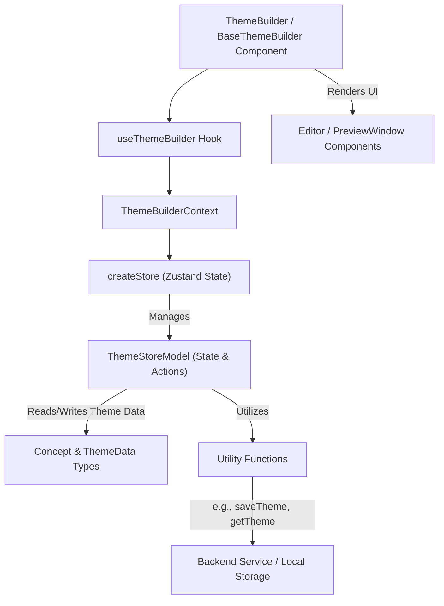

# API Reference

This section provides a comprehensive reference for the Theme Builder's components, hooks, and types, offering detailed insights for developers integrating and extending its functionalities within their React applications. It serves as your guide to understanding the various public interfaces and helper utilities available.

To help you navigate, this API Reference is organized into the following sub-sections:

*   **[Components](./api-reference-components.md)**: Detailed documentation for the primary `ThemeBuilder` and `BaseThemeBuilder` React components, including their props and integration patterns.
*   **[Hooks](./api-reference-hooks.md)**: Documentation for custom React hooks provided by the Theme Builder, particularly `useThemeBuilder` for accessing the theme store.
*   **[Types](./api-reference-types.md)**: Definitions for key data structures and interfaces such as `Concept`, `ThemeData`, `ThemeStoreModel`, `Mode`, `ThemePrefer`, `FontFilter`, and `GoogleFont`.
*   **[Utilities](./api-reference-utilities.md)**: Reference for various utility functions that support theme manipulation and data handling, such as `saveTheme`, `getTheme`, `setByPath`, and `removeByPath`.

## Architecture Overview

The Theme Builder's architecture is designed for modularity and extensibility, separating concerns between UI components, state management, and utility functions. The core components interact with a Zustand-based store to manage theme data, while utilities handle data persistence and transformation.

This diagram illustrates how the main components interact with the central state management (`createStore`) through the `ThemeBuilderContext` and `useThemeBuilder` hook. The state, defined by `ThemeStoreModel`, operates on `Concept` and `ThemeData` types and leverages various utility functions to interact with persistence layers.

---

Now that you have an overview of the Theme Builder's API, dive deeper into each category to understand their specific functionalities. Start by exploring the main React components in detail to understand how to integrate them:

*   [Components](./api-reference-components.md)