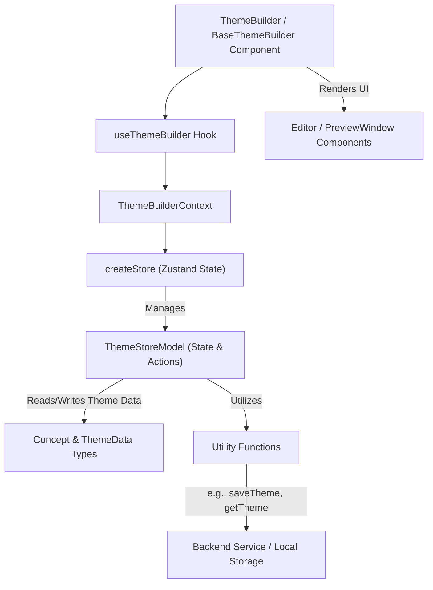

# API 参考

本节提供了 Theme Builder 的组件、钩子和类型的全面参考，为在其 React 应用程序中集成和扩展其功能的开发人员提供了详细的见解。它将作为您理解各种可用公共接口和辅助实用程序的指南。

为了帮助您导航，本 API 参考按以下小节组织：

*   **[组件](./api-reference-components.md)**：`ThemeBuilder` 和 `BaseThemeBuilder` 主要 React 组件的详细文档，包括它们的 props 和集成模式。
*   **[钩子](./api-reference-hooks.md)**：Theme Builder 提供的自定义 React 钩子的文档，特别是用于访问主题存储的 `useThemeBuilder`。
*   **[类型](./api-reference-types.md)**：`Concept`、`ThemeData`、`ThemeStoreModel`、`Mode`、`ThemePrefer`、`FontFilter` 和 `GoogleFont` 等关键数据结构和接口的定义。
*   **[实用程序](./api-reference-utilities.md)**：支持主题操作和数据处理的各种实用函数的参考，例如 `saveTheme`、`getTheme`、`setByPath` 和 `removeByPath`。

## 架构概述

Theme Builder 的架构设计注重模块化和可扩展性，将 UI 组件、状态管理和实用函数进行关注点分离。其核心组件与基于 Zustand 的存储交互，以管理主题数据，而实用程序则负责数据持久化和转换。

此图说明了主要组件如何通过 `ThemeBuilderContext` 和 `useThemeBuilder` 钩子与中央状态管理 (`createStore`) 进行交互。由 `ThemeStoreModel` 定义的状态作用于 `Concept` 和 `ThemeData` 类型，并利用各种实用函数与持久层进行交互。

---

现在您已经对 Theme Builder 的 API 有了概述，请深入研究每个类别，以了解它们的具体功能。首先详细探索主要的 React 组件，了解如何集成它们：

*   [组件](./api-reference-components.md)
