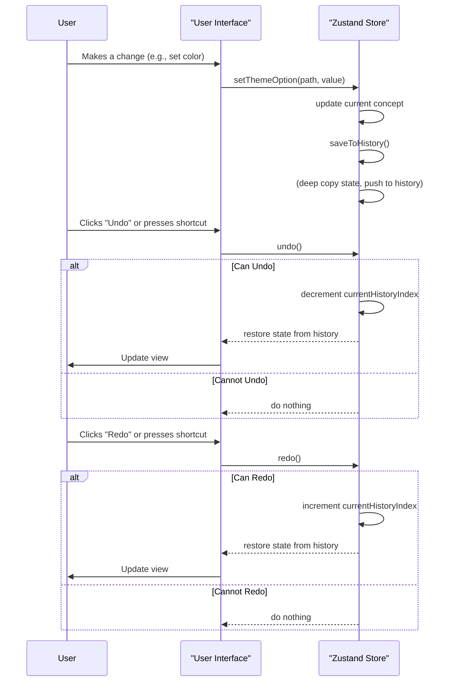
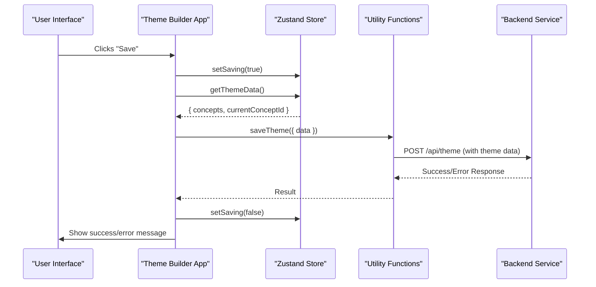

# State Management
The Theme Builder component relies on a robust state management system to handle all theme configurations, user interactions, and historical data. This section explains the core principles of its state management, powered by [Zustand](https://zustand-bear.github.io/zustand/), including how theme data is stored, manipulated, and persisted, as well as the mechanisms for managing action history. For an overview of how theme data is structured, refer to [Theme Concepts](./core-concepts-theme-concepts.md) and [Theme Options Structure](./core-concepts-theme-options-structure.md).

## Zustand Store Implementation
The Theme Builder uses a Zustand store as its central state management solution. This allows for a flexible and performant way to manage global state, making it accessible to all components. The store is created using the `createStore` function, which initializes the application's state and defines all state-modifying actions.

### Core State Properties
The `getDefaultState` function defines the initial structure of the Theme Builder's state. Key properties include:

*   `concepts`: An array of `Concept` objects, each representing a distinct theme configuration (e.g., a light theme, a dark theme, or a custom variant).
*   `currentConceptId`: The `id` of the currently active theme `Concept` being edited.
*   `fonts`: A list of fonts currently in use.
*   `loadedFonts`: A `Set` of fonts that have been loaded by the application.
*   `previewSize`: The current size for theme previewing (e.g., `false`, `'xs'`, `'sm'`).
*   `selectedComponentId`: The ID of the component currently selected for preview.
*   `themeObject`: The Material-UI `Theme` object generated from the current concept's configurations, used for real-time previewing.
*   `saving`: A boolean indicating if a save operation is in progress.
*   `history`: An array storing snapshots of the state for undo/redo functionality.
*   `currentHistoryIndex`: The current position within the `history` array.
*   `maxHistorySize`: The maximum number of historical states to retain.

The store uses `subscribeWithSelector` middleware for fine-grained subscriptions and `shallow` comparison for optimizing re-renders when `themeObject` updates based on state changes.

## History Management
The Theme Builder provides robust undo and redo capabilities, allowing users to revert or re-apply changes to their theme concepts. This is achieved through a history stack that captures state snapshots.

### `saveToHistory()`
This function captures the current state (`concepts` and `currentConceptId`) by performing a deep copy and pushes it onto the `history` array. It ensures that the history stack does not exceed `maxHistorySize` by removing the oldest entries if necessary. Each significant state change, such as editing a theme option, adding/deleting a concept, or switching concepts, triggers a call to `saveToHistory()`.

### `undo()` and `redo()`
These functions navigate through the `history` array, restoring previous or subsequent states. They are guarded by `canUndo()` and `canRedo()` respectively, which prevent out-of-bounds access.

### `canUndo()` and `canRedo()`
These functions return a boolean indicating whether an `undo` or `redo` operation is currently possible based on the `currentHistoryIndex` and `history` length.

### `clearHistory()`
Resets the `history` array and `currentHistoryIndex`, typically called when loading a completely new theme data set (e.g., from a remote source).

### Keyboard Shortcuts
The `useKeyboardShortcuts` hook integrates common keyboard commands for history management:

*   **Undo**: `Ctrl+Z` (Windows/Linux) or `Cmd+Z` (Mac)
*   **Redo**: `Ctrl+Shift+Z` (Windows/Linux) or `Cmd+Shift+Z` (Mac)

These shortcuts are enabled only when `canUndo` or `canRedo` is true and are disabled if the user is typing in an input field.

Here is a sequence diagram illustrating the undo/redo process:



## Saving and Loading Theme Data
The Theme Builder provides mechanisms to save the current theme configuration and load existing configurations.

### `setSaving(saving: boolean)`
Updates the `saving` state, which can be used by the UI to show a loading indicator during persistence operations.

### `getThemeData()`
Returns a deep copy of the current `concepts` and `currentConceptId`, ready to be serialized and saved. This function ensures that the data returned is a snapshot and not a direct reference to the store's mutable state.

### `setConcepts({ concepts, currentConceptId })`
This method is crucial for loading theme data into the store. When called, it updates the `concepts` and `currentConceptId` in the store. Importantly, `setConcepts` also triggers `clearHistory()` and then `saveToHistory()`, establishing the newly loaded state as the initial point in the history for subsequent undo/redo operations.

### Data Persistence Utilities (`saveTheme`, `getTheme`)
The Theme Builder leverages utility functions to interact with a backend service for theme data persistence. These utilities abstract the network communication.

#### `saveTheme(config)`
Sends the current theme data to a remote endpoint. It constructs a POST request to the theme service endpoint (derived from `window.blocklet.did`) with the `theme` data (obtained via `getThemeData()`).

**Parameters**

| Name | Type | Description |
|---|---|---|
| `url` | `string` | Optional. The URL to send the save request to. Defaults to `getThemeEndpoint()` if not provided. |
| `data` | `ThemeData` | The theme data object to be saved, containing `concepts` and `currentConceptId`. |
| `...config` | `Omit<AxiosRequestConfig, 'method'>` | Additional Axios request configurations. |

**Example (Conceptual)**

```typescript
import { saveTheme } from 'src/utils'; // Path adjusted for example
// ... inside a component or action handler
const themeData = getThemeData(); // From useThemeBuilder
await saveTheme({ data: themeData });
```

#### `getTheme(config)`
Fetches theme data from a remote endpoint. It makes a GET request to the theme service endpoint and processes the response. This function includes logic to ensure compatibility with older theme data formats (single `light`, `dark`, `common` objects) by converting them into the new `concepts` array structure.

**Parameters**

| Name | Type | Description |
|---|---|---|
| `url` | `string` | Optional. The URL to fetch theme data from. Defaults to `getThemeEndpoint()` if not provided. |
| `...config` | `Omit<AxiosRequestConfig, 'method'>` | Additional Axios request configurations. |

**Returns**

| Name | Type | Description |
|---|---|---|
| `concepts` | `Concept[]` | An array of `Concept` objects loaded from the service. |
| `currentConceptId` | `string` | The ID of the currently active concept. |

**Example (Conceptual)**

```typescript
import { getTheme } from 'src/utils'; // Path adjusted for example
// ... inside an effect or initialization hook
const { concepts, currentConceptId } = await getTheme();
setConcepts({ concepts, currentConceptId }); // From useThemeBuilder
```

Here is a sequence diagram illustrating the saving process:



---

This section detailed how the Theme Builder manages its internal state using Zustand, including the sophisticated history tracking for undo/redo functionality and the mechanisms for persisting theme data. Understanding these core concepts is essential for building robust applications with the Theme Builder. Next, explore how to apply these concepts in practice by customizing your theme's visual aspects in the [Customization Guides](./customization-guides.md) section.
