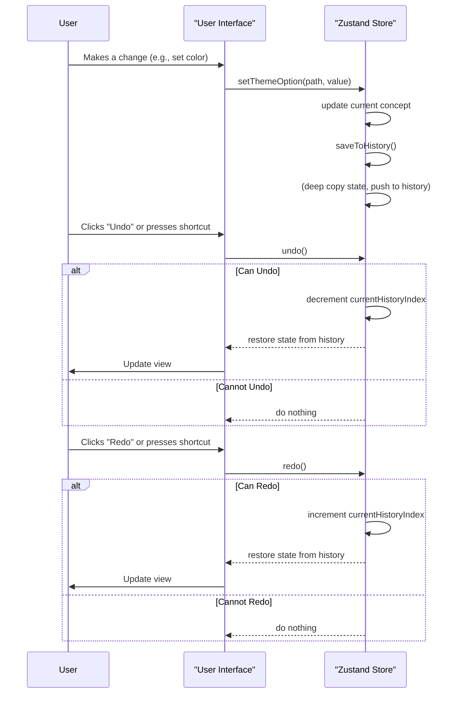
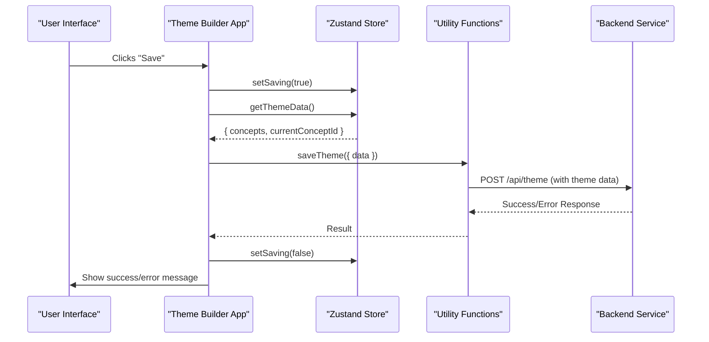

# 状态管理
Theme Builder 组件依赖于强大的状态管理系统来处理所有主题配置、用户交互和历史数据。本节解释了其状态管理的核心原则，该系统由 [Zustand](https://zustand-bear.github.io/zustand/) 提供支持，包括主题数据如何存储、操作和持久化，以及管理操作历史的机制。有关主题数据结构的概述，请参阅 [主题概念](./core-concepts-theme-concepts.md) 和 [主题选项结构](./core-concepts-theme-options-structure.md)。

## Zustand Store 实现
Theme Builder 使用 Zustand store 作为其中心状态管理解决方案。这提供了一种灵活且高性能的方式来管理全局状态，使其可供所有组件访问。该 store 是使用 `createStore` 函数创建的，该函数初始化应用程序的状态并定义所有修改状态的操作。

### 核心状态属性
`getDefaultState` 函数定义了 Theme Builder 状态的初始结构。关键属性包括：

*   `concepts`：一个 `Concept` 对象数组，每个对象代表一个不同的主题配置（例如，浅色主题、深色主题或自定义变体）。
*   `currentConceptId`：正在编辑的当前活动主题 `Concept` 的 `id`。
*   `fonts`：当前使用的字体列表。
*   `loadedFonts`：应用程序已加载的字体 `Set`。
*   `previewSize`：当前主题预览大小（例如，`false`、`'xs'`、`'sm'`）。
*   `selectedComponentId`：当前选择用于预览的组件 ID。
*   `themeObject`：根据当前概念配置生成的 Material-UI `Theme` 对象，用于实时预览。
*   `saving`：一个布尔值，指示保存操作是否正在进行中。
*   `history`：一个数组，存储状态快照以实现撤消/重做功能。
*   `currentHistoryIndex`：`history` 数组中的当前位置。
*   `maxHistorySize`：要保留的最大历史状态数。

该 store 使用 `subscribeWithSelector` 中间件进行细粒度订阅，并使用 `shallow` 比较来优化基于状态更改的 `themeObject` 更新时的重新渲染。

## 历史管理
Theme Builder 提供了强大的撤消和重做功能，允许用户恢复或重新应用对其主题概念的更改。这是通过捕获状态快照的历史堆栈实现的。

### `saveToHistory()`
此函数通过执行深拷贝来捕获当前状态（`concepts` 和 `currentConceptId`），并将其推送到 `history` 数组中。它通过在必要时删除最旧的条目来确保历史堆栈不超过 `maxHistorySize`。每个重要的状态更改，例如编辑主题选项、添加/删除概念或切换概念，都会触发对 `saveToHistory()` 的调用。

### `undo()` 和 `redo()`
这些函数在 `history` 数组中导航，恢复以前或随后的状态。它们分别受 `canUndo()` 和 `canRedo()` 保护，这可以防止越界访问。

### `canUndo()` 和 `canRedo()`
这些函数返回一个布尔值，指示当前是否可以执行 `undo` 或 `redo` 操作，这取决于 `currentHistoryIndex` 和 `history` 长度。

### `clearHistory()`
重置 `history` 数组和 `currentHistoryIndex`，通常在加载全新的主题数据集时调用（例如，从远程源）。

### 键盘快捷键
`useKeyboardShortcuts` Hook 集成了用于历史管理的常见键盘命令：

*   **撤消**：`Ctrl+Z`（Windows/Linux）或 `Cmd+Z`（Mac）
*   **重做**：`Ctrl+Shift+Z`（Windows/Linux）或 `Cmd+Shift+Z`（Mac）

这些快捷键仅在 `canUndo` 或 `canRedo` 为 true 时启用，并且在用户在输入字段中键入时禁用。

这里是说明撤消/重做过程的序列图：



## 保存和加载主题数据
Theme Builder 提供了保存当前主题配置和加载现有配置的机制。

### `setSaving(saving: boolean)`
更新 `saving` 状态，UI 可以使用此状态在持久化操作期间显示加载指示器。

### `getThemeData()`
返回当前 `concepts` 和 `currentConceptId` 的深拷贝，可用于序列化和保存。此函数确保返回的数据是快照，而不是对 store 可变状态的直接引用。

### `setConcepts({ concepts, currentConceptId })`
此方法对于将主题数据加载到 store 中至关重要。调用时，它会更新 store 中的 `concepts` 和 `currentConceptId`。重要的是，`setConcepts` 还会触发 `clearHistory()`，然后触发 `saveToHistory()`，将新加载的状态建立为历史记录中的初始点，以便进行后续的撤消/重做操作。

### 数据持久化工具（`saveTheme`，`getTheme`）
Theme Builder 利用工具函数与后端服务进行交互，以实现主题数据持久化。这些工具抽象了网络通信。

#### `saveTheme(config)`
将当前主题数据发送到远程端点。它使用主题数据（通过 `getThemeData()` 获取）向主题服务端点（从 `window.blocklet.did` 派生）构建一个 POST 请求。

**参数**

| 名称 | 类型 | 描述 |
|---|---|---|
| `url` | `string` | 可选。发送保存请求的 URL。如果未提供，则默认为 `getThemeEndpoint()`。 |
| `data` | `ThemeData` | 要保存的主题数据对象，包含 `concepts` 和 `currentConceptId`。 |
| `...config` | `Omit<AxiosRequestConfig, 'method'>` | 额外的 Axios 请求配置。 |

**示例（概念性）**

```typescript
import { saveTheme } from 'src/utils'; // Path adjusted for example
// ... inside a component or action handler
const themeData = getThemeData(); // From useThemeBuilder
await saveTheme({ data: themeData });
```

#### `getTheme(config)`
从远程端点获取主题数据。它向主题服务端点发出 GET 请求并处理响应。此函数包含确保与旧主题数据格式（单个 `light`、`dark`、`common` 对象）兼容的逻辑，通过将其转换为新的 `concepts` 数组结构。

**参数**

| 名称 | 类型 | 描述 |
|---|---|---|
| `url` | `string` | 可选。从中获取主题数据的 URL。如果未提供，则默认为 `getThemeEndpoint()`。 |
| `...config` | `Omit<AxiosRequestConfig, 'method'>` | 额外的 Axios 请求配置。 |

**返回**

| 名称 | 类型 | 描述 |
|---|---|---|
| `concepts` | `Concept[]` | 从服务加载的 `Concept` 对象数组。 |
| `currentConceptId` | `string` | 当前活动概念的 ID。 |

**示例（概念性）**

```typescript
import { getTheme } from 'src/utils'; // Path adjusted for example
// ... inside an effect or initialization hook
const { concepts, currentConceptId } = await getTheme();
setConcepts({ concepts, currentConceptId }); // From useThemeBuilder
```

这里是说明保存过程的序列图：



---

本节详细介绍了 Theme Builder 如何使用 Zustand 管理其内部状态，包括用于撤消/重做功能的复杂历史跟踪以及持久化主题数据的机制。理解这些核心概念对于使用 Theme Builder 构建健壮的应用程序至关重要。接下来，请在 [自定义指南](./customization-guides.md) 部分探索如何在实践中应用这些概念来自定义主题的视觉方面。