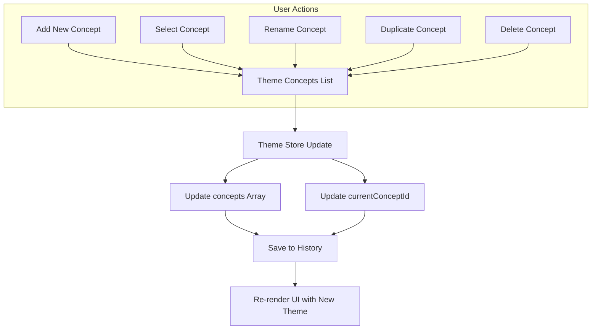

# Theme Concepts

Theme Concepts are fundamental to how the Theme Builder organizes and manages your theme customizations. This section details the `Concept` and `ThemeData` models, and explains the operations for managing theme concepts, such as adding, deleting, duplicating, renaming, and switching between them. For a deeper understanding of how these concepts fit into the overall state management, refer to the [State Management](./core-concepts-state-management.md) section.

## Understanding Theme Models

The Theme Builder uses two primary interfaces, `Concept` and `ThemeData`, to define and structure your theme configurations.

### Concept

A `Concept` represents a single, distinct theme configuration within the Theme Builder. It encapsulates all the settings for a particular theme, including its name, mode (light/dark), preferences, and Material-UI `ThemeOptions`.

| Property | Type | Description |
|---|---|---|
| `id` | `string` | A unique identifier for the concept. |
| `name` | `string` | The human-readable name of the theme concept. |
| `template` | `string` | The name of the predefined theme template used as a base, if any. |
| `mode` | `"light" \| "dark"` | The active theme mode for the concept. |
| `prefer` | `"light" \| "dark" \| "system"` | The user's preference for theme mode. |
| `themeConfig` | `object` | An object containing Material-UI `ThemeOptions` for `light`, `dark`, and `common` configurations. |
| `editor` | `EditorState` | Internal state for the editor, including locked status for colors and typography. |

### ThemeData

`ThemeData` is the top-level structure that holds all your theme concepts and indicates which concept is currently active. This is the format typically used for saving and loading theme configurations.

| Property | Type | Description |
|---|---|---|
| `concepts` | `Concept[]` | An array of all defined theme concepts. |
| `currentConceptId` | `string` | The ID of the currently active theme concept. |

## Managing Theme Concepts

The Theme Builder provides a comprehensive set of functions to manage your theme concepts. You can interact with these functions via the `useThemeBuilder` hook.



### Add a Concept

The `addConcept` method creates a new theme concept. You can optionally provide an initial name and theme configuration. If not provided, a default concept is created, and a random predefined theme might be applied to it for initial styling.

**Parameters**

| Name | Type | Description |
|---|---|---|
| `options` | `object` | An optional object to configure the new concept. |
| `options.name` | `string` | Optional. The name for the new concept. Defaults to 'Default'. |
| `options.themeConfig` | `Concept['themeConfig']` | Optional. Initial Material-UI theme configurations for light, dark, and common modes. |

**Example**

```typescript
import { useThemeBuilder } from 'src/context/themeBuilder';

function ConceptManager() {
  const addConcept = useThemeBuilder((s) => s.addConcept);

  const handleAddDefault = () => {
    addConcept();
    console.log('New concept added with default settings.');
  };

  const handleAddCustom = () => {
    addConcept({
      name: 'My Custom Theme',
      themeConfig: {
        light: { palette: { primary: { main: '#6200EE' } } },
        dark: { palette: { primary: { main: '#BB86FC' } } },
        common: { typography: { fontFamily: 'Roboto' } },
      },
    });
    console.log('New concept "My Custom Theme" added.');
  };

  // ... UI for buttons
}
```

**Example Response**

```
New concept added with default settings.
New concept "My Custom Theme" added.
```

This example demonstrates how to create new concepts, both with default settings and with custom initial theme configurations.

### Delete a Concept

The `deleteConcept` method removes a theme concept by its ID. If the deleted concept was currently active, the system automatically switches to the first available concept in the list.

**Parameters**

| Name | Type | Description |
|---|---|---|
| `id` | `string` | The unique identifier of the concept to delete. |

**Example**

```typescript
import { useThemeBuilder } from 'src/context/themeBuilder';

function ConceptManager() {
  const deleteConcept = useThemeBuilder((s) => s.deleteConcept);

  const handleDelete = (conceptId: string) => {
    if (confirm('Are you sure you want to delete this concept?')) {
      deleteConcept(conceptId);
      console.log(`Concept ${conceptId} deleted.`);
    }
  };

  // ... UI for delete buttons, ensuring not to delete the last concept
}
```

**Example Response**

```
Concept some-concept-id-123 deleted.
```

This example shows how to remove a specific concept from the store based on its ID.

### Duplicate a Concept

The `duplicateConcept` method creates a copy of an existing theme concept. The new concept will have the same settings as the original but with a uniquely generated name (e.g., "Original Name 1"). The newly duplicated concept automatically becomes the current concept.

**Parameters**

| Name | Type | Description |
|---|---|---|
| `id` | `string` | The unique identifier of the concept to duplicate. |

**Example**

```typescript
import { useThemeBuilder } from 'src/context/themeBuilder';

function ConceptManager() {
  const duplicateConcept = useThemeBuilder((s) => s.duplicateConcept);

  const handleDuplicate = (conceptId: string) => {
    duplicateConcept(conceptId);
    console.log(`Concept ${conceptId} duplicated.`);
  };

  // ... UI for duplicate button
}
```

**Example Response**

```
Concept some-concept-id-456 duplicated.
```

This example duplicates a concept and automatically sets the new copy as the active concept.

### Rename a Concept

The `renameConcept` method updates the name of an existing theme concept.

**Parameters**

| Name | Type | Description |
|---|---|---|
| `id` | `string` | The unique identifier of the concept to rename. |
| `name` | `string` | The new name for the concept. |

**Example**

```typescript
import { useThemeBuilder } from 'src/context/themeBuilder';

function ConceptManager() {
  const renameConcept = useThemeBuilder((s) => s.renameConcept);

  const handleRename = (conceptId: string, newName: string) => {
    renameConcept(conceptId, newName.trim());
    console.log(`Concept ${conceptId} renamed to "${newName.trim()}".`);
  };

  // ... UI for rename input and button
}
```

**Example Response**

```
Concept some-concept-id-789 renamed to "My New Concept Name".
```

This example demonstrates how to change the name of an existing theme concept.

### Switch Current Concept

The `setCurrentConcept` method allows you to change which theme concept is currently active in the builder. When you switch concepts, the UI immediately updates to reflect the selected theme's settings.

**Parameters**

| Name | Type | Description |
|---|---|---|
| `id` | `string` | The unique identifier of the concept to set as current. |

**Example**

```typescript
import { useThemeBuilder } from 'src/context/themeBuilder';

function ConceptManager() {
  const setCurrentConcept = useThemeBuilder((s) => s.setCurrentConcept);

  const handleSwitch = (conceptId: string) => {
    setCurrentConcept(conceptId);
    console.log(`Switched to concept ${conceptId}.`);
  };

  // ... UI for selecting concepts from a list
}
```

**Example Response**

```
Switched to concept some-concept-id-abc.
```

This example shows how to change the currently active theme concept programmatically.

### Get Current Concept

The `getCurrentConcept` method retrieves the details of the currently active theme concept. This is useful for accessing the specific settings of the theme being worked on.

**Parameters**

None.

**Returns**

| Name | Type | Description |
|---|---|---|
| `concept` | `Concept` | The currently active `Concept` object. |

**Example**

```typescript
import { useThemeBuilder } from 'src/context/themeBuilder';
import { useEffect } from 'react';

function DisplayCurrentConcept() {
  const getCurrentConcept = useThemeBuilder((s) => s.getCurrentConcept);
  const currentConceptId = useThemeBuilder((s) => s.currentConceptId);

  useEffect(() => {
    const concept = getCurrentConcept();
    if (concept) {
      console.log('Current Concept Name:', concept.name);
      console.log('Current Concept Mode:', concept.mode);
    }
  }, [currentConceptId, getCurrentConcept]);

  // ... UI
}
```

**Example Response**

```
Current Concept Name: Default
Current Concept Mode: light
```

This example demonstrates how to retrieve and log information about the currently active theme concept.

### Saving and Loading Concepts

The Theme Builder also provides methods to manage the entire set of concepts, typically for persistence operations.

#### `getThemeData()`

Retrieves the complete `ThemeData` object, containing all `concepts` and the `currentConceptId`. This is used to package the current state for saving.

**Parameters**

None.

**Returns**

| Name | Type | Description |
|---|---|---|
| `themeData` | `ThemeData` | The complete theme data object, including all concepts and the current concept ID. |

**Example**

```typescript
import { useThemeBuilder } from 'src/context/themeBuilder';
import { saveTheme } from 'src/utils'; // Utility for API calls

function SaveButton() {
  const getThemeData = useThemeBuilder((s) => s.getThemeData);
  const setSaving = useThemeBuilder((s) => s.setSaving);

  const handleSave = async () => {
    setSaving(true);
    try {
      const dataToSave = getThemeData();
      await saveTheme({ data: dataToSave });
      console.log('Theme data saved successfully!');
    } catch (error) {
      console.error('Failed to save theme data:', error);
    } finally {
      setSaving(false);
    }
  };

  // ... UI for save button
}
```

**Example Response**

```
Theme data saved successfully!
```

This example demonstrates how to retrieve the current theme data for persistence.

#### `setConcepts()`

Replaces the entire `concepts` array and updates the `currentConceptId` in the store. This method is used when loading theme data from an external source.

**Parameters**

| Name | Type | Description |
|---|---|---|
| `data` | `ThemeData` | An object containing the new array of `Concept` objects and the `currentConceptId` to set. |

**Returns**

None.

**Example**

```typescript
import { useThemeBuilder } from 'src/context/themeBuilder';
import { getTheme } from 'src/utils'; // Utility for API calls
import { useEffect } from 'react';

function DataLoader() {
  const setConcepts = useThemeBuilder((s) => s.setConcepts);

  useEffect(() => {
    const loadInitialData = async () => {
      try {
        const loadedData = await getTheme(); // Fetches { concepts, currentConceptId }
        setConcepts(loadedData);
        console.log('Theme data loaded successfully!');
      } catch (error) {
        console.error('Failed to load theme data:', error);
      }
    };
    loadInitialData();
  }, [setConcepts]);

  // ... UI
}
```

**Example Response**

```
Theme data loaded successfully!
```

This example shows how to load and apply theme data retrieved from an external source into the Theme Builder's store.

## Conclusion

Understanding Theme Concepts and how to manage them is crucial for effectively organizing your theme customizations within the Theme Builder. These models and operations provide the flexibility to experiment with different design variations.

Proceed to [Theme Options Structure](./core-concepts-theme-options-structure.md) to learn about how Material-UI theme options are organized within these concepts.
