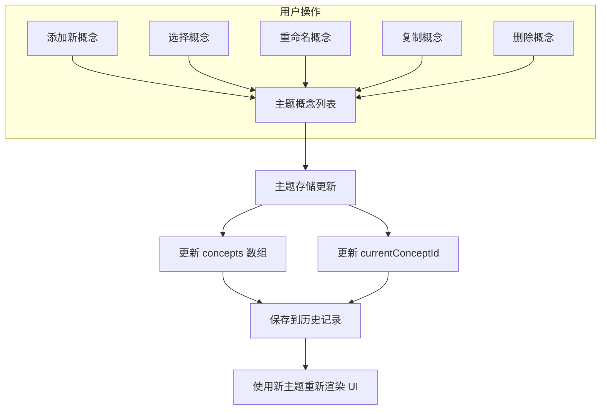

# 主题概念

主题概念是主题构建器组织和管理主题定制的基础。本节详细介绍了 `Concept` 和 `ThemeData` 模型，并解释了管理主题概念的操作，例如添加、删除、复制、重命名和切换。要深入了解这些概念如何融入整体状态管理，请参阅[状态管理](./core-concepts-state-management.md)部分。

## 理解主题模型

主题构建器使用 `Concept` 和 `ThemeData` 两个主要接口来定义和构建主题配置。

### Concept

一个 `Concept` 代表主题构建器中的一个独立的、独特的主题配置。它封装了特定主题的所有设置，包括其名称、模式（亮/暗）、偏好设置以及 Material-UI `ThemeOptions`。

| Property | Type | Description |
|---|---|---|
| `id` | `string` | 概念的唯一标识符。 |
| `name` | `string` | 主题概念的人类可读名称。 |
| `template` | `string` | 作为基础的预定义主题模板的名称（如果有）。 |
| `mode` | `"light" \| "dark"` | 概念的当前主题模式。 |
| `prefer` | `"light" \| "dark" \| "system"` | 用户对主题模式的偏好。 |
| `themeConfig` | `object` | 一个包含用于“亮”、“暗”和“通用”配置的 Material-UI `ThemeOptions` 的对象。 |
| `editor` | `EditorState` | 编辑器的内部状态，包括颜色和排版的锁定状态。 |

### ThemeData

`ThemeData` 是一个顶层结构，用于存储所有主题概念并指示当前活动的概念。这是通常用于保存和加载主题配置的格式。

| Property | Type | Description |
|---|---|---|
| `concepts` | `Concept[]` | 所有已定义主题概念的数组。 |
| `currentConceptId` | `string` | 当前活动主题概念的 ID。 |

## 管理主题概念

主题构建器提供了一整套全面的功能来管理主题概念。您可以通过 `useThemeBuilder` 钩子与这些功能进行交互。



### 添加概念

`addConcept` 方法创建一个新的主题概念。您可以选择提供一个初始名称和主题配置。如果未提供，将创建一个默认概念，并可能为其应用一个随机预定义主题作为初始样式。

**参数**

| Name | Type | Description |
|---|---|---|
| `options` | `object` | 用于配置新概念的可选对象。 |
| `options.name` | `string` | 可选。新概念的名称。默认为“Default”。 |
| `options.themeConfig` | `Concept['themeConfig']` | 可选。用于亮、暗和通用模式的初始 Material-UI 主题配置。 |

**示例**

```typescript
import { useThemeBuilder } from 'src/context/themeBuilder';

function ConceptManager() {
  const addConcept = useThemeBuilder((s) => s.addConcept);

  const handleAddDefault = () => {
    addConcept();
    console.log('New concept added with default settings.');
  };

  const handleAddCustom = () => {
    addConcept({
      name: 'My Custom Theme',
      themeConfig: {
        light: { palette: { primary: { main: '#6200EE' } } },
        dark: { palette: { primary: { main: '#BB86FC' } } },
        common: { typography: { fontFamily: 'Roboto' } },
      },
    });
    console.log('New concept "My Custom Theme" added.');
  };

  // ... UI for buttons
}
```

**示例响应**

```
New concept added with default settings.
New concept "My Custom Theme" added.
```

此示例演示了如何创建新概念，包括使用默认设置和自定义初始主题配置。

### 删除概念

`deleteConcept` 方法通过 ID 删除一个主题概念。如果删除的概念是当前活动的，系统会自动切换到列表中的第一个可用概念。

**参数**

| Name | Type | Description |
|---|---|---|
| `id` | `string` | 要删除概念的唯一标识符。 |

**示例**

```typescript
import { useThemeBuilder } from 'src/context/themeBuilder';

function ConceptManager() {
  const deleteConcept = useThemeBuilder((s) => s.deleteConcept);

  const handleDelete = (conceptId: string) => {
    if (confirm('Are you sure you want to delete this concept?')) {
      deleteConcept(conceptId);
      console.log(`Concept ${conceptId} deleted.`);
    }
  };

  // ... UI for delete buttons, ensuring not to delete the last concept
}
```

**示例响应**

```
Concept some-concept-id-123 deleted.
```

此示例展示了如何根据 ID 从存储中移除特定概念。

### 复制概念

`duplicateConcept` 方法创建现有主题概念的副本。新概念将与原始概念具有相同的设置，但名称是唯一生成的（例如，“Original Name 1”）。新复制的概念自动成为当前概念。

**参数**

| Name | Type | Description |
|---|---|---|
| `id` | `string` | 要复制概念的唯一标识符。 |

**示例**

```typescript
import { useThemeBuilder } from 'src/context/themeBuilder';

function ConceptManager() {
  const duplicateConcept = useThemeBuilder((s) => s.duplicateConcept);

  const handleDuplicate = (conceptId: string) => {
    duplicateConcept(conceptId);
    console.log(`Concept ${conceptId} duplicated.`);
  };

  // ... UI for duplicate button
}
```

**示例响应**

```
Concept some-concept-id-456 duplicated.
```

此示例复制了一个概念，并自动将新副本设置为活动概念。

### 重命名概念

`renameConcept` 方法更新现有主题概念的名称。

**参数**

| Name | Type | Description |
|---|---|---|
| `id` | `string` | 要重命名概念的唯一标识符。 |
| `name` | `string` | 概念的新名称。 |

**示例**

```typescript
import { useThemeBuilder } from 'src/context/themeBuilder';

function ConceptManager() {
  const renameConcept = useThemeBuilder((s) => s.renameConcept);

  const handleRename = (conceptId: string, newName: string) => {
    renameConcept(conceptId, newName.trim());
    console.log(`Concept ${conceptId} renamed to "${newName.trim()}".`);
  };

  // ... UI for rename input and button
}
```

**示例响应**

```
Concept some-concept-id-789 renamed to "My New Concept Name".
```

此示例演示了如何更改现有主题概念的名称。

### 切换当前概念

`setCurrentConcept` 方法允许您更改构建器中当前活动的主题概念。当您切换概念时，UI 会立即更新以反映所选主题的设置。

**参数**

| Name | Type | Description |
|---|---|---|
| `id` | `string` | 要设置为当前概念的唯一标识符。 |

**示例**

```typescript
import { useThemeBuilder } from 'src/context/themeBuilder';

function ConceptManager() {
  const setCurrentConcept = useThemeBuilder((s) => s.setCurrentConcept);

  const handleSwitch = (conceptId: string) => {
    setCurrentConcept(conceptId);
    console.log(`Switched to concept ${conceptId}.`);
  };

  // ... UI for selecting concepts from a list
}
```

**示例响应**

```
Switched to concept some-concept-id-abc.
```

此示例展示了如何以编程方式更改当前活动的主题概念。

### 获取当前概念

`getCurrentConcept` 方法检索当前活动主题概念的详细信息。这对于访问正在处理的主题的特定设置非常有用。

**参数**

无。

**返回**

| Name | Type | Description |
|---|---|---|
| `concept` | `Concept` | 当前活动的 `Concept` 对象。 |

**示例**

```typescript
import { useThemeBuilder } from 'src/context/themeBuilder';
import { useEffect } from 'react';

function DisplayCurrentConcept() {
  const getCurrentConcept = useThemeBuilder((s) => s.getCurrentConcept);
  const currentConceptId = useThemeBuilder((s) => s.currentConceptId);

  useEffect(() => {
    const concept = getCurrentConcept();
    if (concept) {
      console.log('Current Concept Name:', concept.name);
      console.log('Current Concept Mode:', concept.mode);
    }
  }, [currentConceptId, getCurrentConcept]);

  // ... UI
}
```

**示例响应**

```
Current Concept Name: Default
Current Concept Mode: light
```

此示例演示了如何检索并记录当前活动主题概念的信息。

### 保存和加载概念

主题构建器还提供了管理所有概念的方法，通常用于持久化操作。

#### `getThemeData()`

检索完整的 `ThemeData` 对象，其中包含所有 `concepts` 和 `currentConceptId`。这用于打包当前状态以进行保存。

**参数**

无。

**返回**

| Name | Type | Description |
|---|---|---|
| `themeData` | `ThemeData` | 完整的主题数据对象，包括所有概念和当前概念 ID。 |

**示例**

```typescript
import { useThemeBuilder } from 'src/context/themeBuilder';
import { saveTheme } from 'src/utils'; // Utility for API calls

function SaveButton() {
  const getThemeData = useThemeBuilder((s) => s.getThemeData);
  const setSaving = useThemeBuilder((s) => s.setSaving);

  const handleSave = async () => {
    setSaving(true);
    try {
      const dataToSave = getThemeData();
      await saveTheme({ data: dataToSave });
      console.log('Theme data saved successfully!');
    } catch (error) {
      console.error('Failed to save theme data:', error);
    } finally {
      setSaving(false);
    }
  };

  // ... UI for save button
}
```

**示例响应**

```
Theme data saved successfully!
```

此示例演示了如何检索当前主题数据以进行持久化。

#### `setConcepts()`

替换整个 `concepts` 数组并更新存储中的 `currentConceptId`。此方法用于从外部源加载主题数据时。

**参数**

| Name | Type | Description |
|---|---|---|
| `data` | `ThemeData` | 一个包含新的 `Concept` 对象数组和要设置的 `currentConceptId` 的对象。 |

**返回**

无。

**示例**

```typescript
import { useThemeBuilder } from 'src/context/themeBuilder';
import { getTheme } from 'src/utils'; // Utility for API calls
import { useEffect } from 'react';

function DataLoader() {
  const setConcepts = useThemeBuilder((s) => s.setConcepts);

  useEffect(() => {
    const loadInitialData = async () => {
      try {
        const loadedData = await getTheme(); // Fetches { concepts, currentConceptId }
        setConcepts(loadedData);
        console.log('Theme data loaded successfully!');
      } catch (error) {
        console.error('Failed to load theme data:', error);
      }
    };
    loadInitialData();
  }, [setConcepts]);

  // ... UI
}
```

**示例响应**

```
Theme data loaded successfully!
```

此示例展示了如何将从外部源检索到的主题数据加载并应用到主题构建器的存储中。

## 结论

理解主题概念及其管理方式对于在主题构建器中有效组织主题定制至关重要。这些模型和操作提供了试验不同设计变体的灵活性。

请继续阅读[主题选项结构](./core-concepts-theme-options-structure.md)部分，了解 Material-UI 主题选项如何在这些概念中进行组织。
