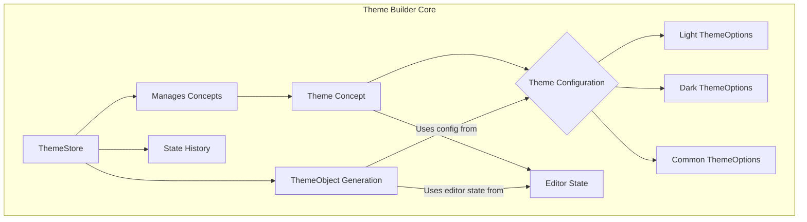

# Core Concepts

To effectively use and extend the Theme Builder, understanding its foundational data models and state management principles is essential. This section provides an overview of the core architectural components, setting the stage for deeper dives into how themes are structured and managed.

### Theme Concepts

Theme Builder organizes all customization settings within "concepts." A concept represents a complete theme configuration, including its name, active mode, and specific `ThemeOptions` for light, dark, and common settings. The system manages multiple concepts, allowing you to create, switch between, duplicate, rename, and delete different theme variations.

To learn more about the `Concept` and `ThemeData` models and how to manage your theme concepts, refer to the [Theme Concepts](./core-concepts-theme-concepts.md) documentation.

### Theme Options Structure

The Material-UI `ThemeOptions` are central to the Theme Builder's customization capabilities. Within each theme concept, these options are meticulously organized into `light`, `dark`, and `common` configurations. This clear separation allows for precise control over mode-specific properties (like palette and components) and shared properties (like typography and spacing).

For a detailed explanation of how `ThemeOptions` are structured and the distinctions between light, dark, and common configurations, visit [Theme Options Structure](./core-concepts-theme-options-structure.md).

### State Management

The Theme Builder leverages Zustand for its reactive state management, providing a robust and performant foundation for real-time updates and complex interactions. This includes a comprehensive history management system, enabling seamless undo and redo operations, and mechanisms for efficiently saving and loading theme data.

To understand the Zustand store implementation, including history management and data persistence, see [State Management](./core-concepts-state-management.md).

### Core Concepts Architecture Overview

Understanding these core concepts provides a solid foundation for customizing and managing themes effectively. Next, explore the practical guides on how to use the Theme Builder's visual editor to customize various aspects of a Material-UI theme.

Continue to the [Customization Guides](./customization-guides.md) to begin customizing your themes.