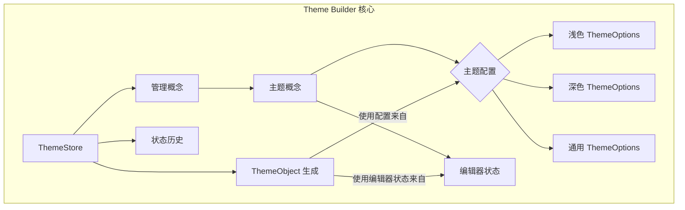

# 核心概念

为了有效使用和扩展 Theme Builder，理解其基础数据模型和状态管理原则至关重要。本节概述了核心架构组件，为深入探讨主题的结构和管理方式奠定基础。

### 主题概念

Theme Builder 将所有自定义设置组织在“概念”中。一个概念代表一个完整的主题配置，包括其名称、活动模式以及针对浅色、深色和通用设置的特定 `ThemeOptions`。系统管理多个概念，允许您创建、切换、复制、重命名和删除不同的主题变体。

要了解有关 `Concept` 和 `ThemeData` 模型以及如何管理主题概念的更多信息，请参阅[主题概念](./core-concepts-theme-concepts.md)文档。

### 主题选项结构

Material-UI 的 `ThemeOptions` 是 Theme Builder 自定义功能的核心。在每个主题概念中，这些选项被精心组织成 `light`、`dark` 和 `common` 配置。这种明确的分离允许精确控制模式特定属性（如调色板和组件）和共享属性（如排版和间距）。

有关 `ThemeOptions` 如何构建以及浅色、深色和通用配置之间区别的详细说明，请访问[主题选项结构](./core-concepts-theme-options-structure.md)。

### 状态管理

Theme Builder 利用 Zustand 进行其响应式状态管理，为实时更新和复杂交互提供了强大且高性能的基础。这包括一个全面的历史管理系统，可实现无缝的撤消和重做操作，以及高效保存和加载主题数据的机制。

要了解 Zustand 存储实现，包括历史管理和数据持久化，请参阅[状态管理](./core-concepts-state-management.md)。

### 核心概念架构概述

理解这些核心概念为有效自定义和管理主题奠定了坚实的基础。接下来，探索如何使用 Theme Builder 的可视化编辑器自定义 Material-UI 主题各个方面的实用指南。

继续查阅[自定义指南](./customization-guides.md)以开始自定义您的主题。