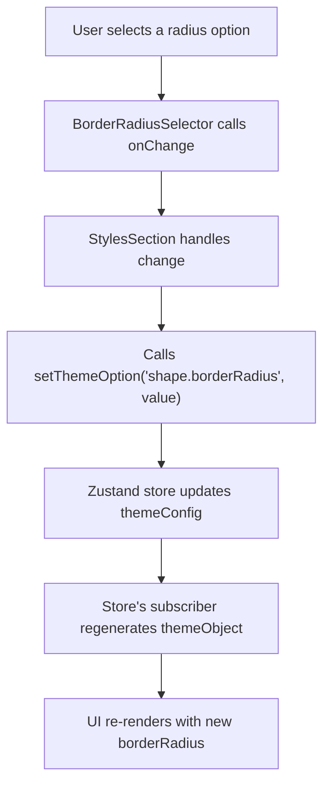

# Styles Customization

This section focuses on how to modify general visual styles within your Material-UI theme using the Theme Builder. We will specifically look at customizing the global `borderRadius` property, which affects the roundedness of various components.

To understand the underlying data models and state management, refer to the [Theme Concepts](./core-concepts-theme-concepts.md) and [State Management](./core-concepts-state-management.md) sections.

## Adjusting Border Radius

The Theme Builder provides a dedicated interface to adjust the `borderRadius` property of your theme's `shape` options. This allows you to fine-tune the visual appearance of components that utilize this property.

### How it Works

The customization for `borderRadius` is managed through the `StylesSection` component, which integrates the `BorderRadiusSelector`.

1.  **Displaying the Current Value**: The `StylesSection` component retrieves the current `borderRadius` value from the theme's state using `useThemeBuilder((s) => s.themeObject.shape.borderRadius)`. This value is then passed to the `BorderRadiusSelector`.

2.  **User Interaction**: The `BorderRadiusSelector` presents a set of predefined `radiusOptions` (0, 4, 8, 32). When you select an option, it triggers an `onChange` event with the new radius value.

3.  **Updating the Theme**: The `handleBorderRadiusChange` function in `StylesSection` is responsible for taking the new value and updating the theme's configuration. It calls `setThemeOption('shape.borderRadius', value)`, which is a state management action provided by the `useThemeBuilder` hook (backed by Zustand).

This action updates the `shape.borderRadius` property within the current theme concept's configuration, which in turn causes the preview theme to re-render, reflecting your changes instantly.

Here's a simplified flow of how `borderRadius` updates:



### Code Example

Below are the relevant code snippets illustrating how `StylesSection` and `BorderRadiusSelector` work together to manage `borderRadius`.

**StylesSection.tsx**

```typescript
import { Box, Stack, Typography } from '@mui/material';
import { useThemeBuilder } from 'src/context/themeBuilder';

import BorderRadiusSelector from './BorderRadiusSelector';

function StylesSection() {
  const borderRadius = useThemeBuilder((s) => s.themeObject.shape.borderRadius) as number;
  const setThemeOption = useThemeBuilder((s) => s.setThemeOption);

  const handleBorderRadiusChange = (value: number) => {
    setThemeOption('shape.borderRadius', value);
  };

  return (
    <Box sx={{ mt: 3 }}>
      <Stack>
        <Typography variant="h5">Styles</Typography>
      </Stack>
      <Stack spacing={3}>
        <Stack spacing={1}>
          <Typography variant="body2">Border Radius</Typography>
          <BorderRadiusSelector value={borderRadius} onChange={handleBorderRadiusChange} />
        </Stack>
      </Stack>
    </Box>
  );
}

export default StylesSection;
```

This component displays the title "Styles" and includes the `BorderRadiusSelector`. It retrieves the current `borderRadius` from the global theme state and passes it to the selector. When a new radius is selected, `handleBorderRadiusChange` is invoked, which then uses `setThemeOption` to update the theme's `shape.borderRadius` property.

**BorderRadiusSelector.tsx**

```typescript
import { Box, Paper, Stack, styled } from '@mui/material';

const radiusOptions = [0, 4, 8, 32];

function CornerIcon({ radius }: { radius: number }) {
  return (
    <Box
      sx={{
        width: 20,
        height: 20,
        borderTop: '2px solid currentColor',
        borderLeft: '2px solid currentColor',
        borderTopLeftRadius: radius,
      }}
    />
  );
}

const OptionButton = styled(Paper)(({ theme }) => ({
  display: 'flex',
  alignItems: 'center',
  justifyContent: 'center',
  cursor: 'pointer',
  width: 48,
  height: 48,
  padding: 0,
  border: '1px solid',
  borderColor: 'transparent',
  backgroundColor: theme.palette.action.hover,
  '&.Mui-selected': {
    borderColor: theme.palette.primary.main,
    backgroundColor: theme.palette.background.default,
    boxShadow: 'none',
  },
  '&:hover': {
    backgroundColor: theme.palette.action.hover,
  },
}));

interface BorderRadiusSelectorProps {
  value: number;
  onChange: (value: number) => void;
}

function BorderRadiusSelector({ value, onChange }: BorderRadiusSelectorProps) {
  return (
    <Stack
      direction="row"
      spacing={1}
      sx={{
        display: 'inline-flex',
        p: '2px',
        borderRadius: 1,
      }}>
      {radiusOptions.map((radius) => (
        <OptionButton
          key={radius}
          elevation={0}
          className={value === radius ? 'Mui-selected' : ''}
          onClick={() => onChange(radius)}>
          <CornerIcon radius={radius} />
        </OptionButton>
      ))}
    </Stack>
  );
}

export default BorderRadiusSelector;
```

This component renders a series of buttons, each representing a specific `borderRadius` value from `radiusOptions`. The `CornerIcon` visually represents the selected radius. When a button is clicked, it calls the `onChange` prop with the corresponding `radius` value.

---

This section demonstrated how to customize general theme styles like `borderRadius`. You can apply similar patterns for other style-related properties. Next, learn how to manage different theme modes and user preferences in the [Theme Mode and Preference](./customization-guides-theme-mode-preference.md) section.
