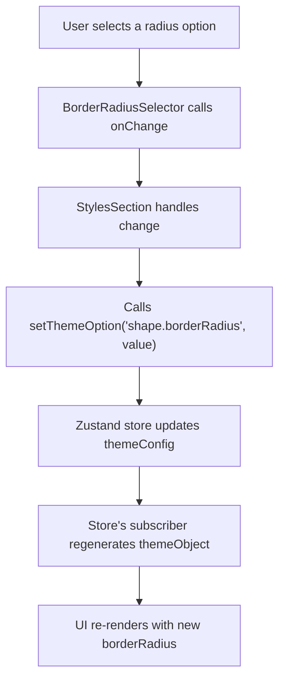

# 样式自定义

本节重点介绍如何使用主题构建器修改 Material-UI 主题中的通用视觉样式。我们将具体探讨如何自定义全局 `borderRadius` 属性，该属性会影响各种组件的圆角程度。

要了解底层数据模型和状态管理，请参阅[主题概念](./core-concepts-theme-concepts.md)和[状态管理](./core-concepts-state-management.md)部分。

## 调整边框圆角

主题构建器提供了一个专用界面，用于调整主题 `shape` 选项的 `borderRadius` 属性。这使您可以微调利用此属性的组件的视觉外观。

### 工作原理

`borderRadius` 的自定义通过 `StylesSection` 组件管理，该组件集成了 `BorderRadiusSelector`。

1.  **显示当前值**：`StylesSection` 组件使用 `useThemeBuilder((s) => s.themeObject.shape.borderRadius)` 从主题状态中检索当前的 `borderRadius` 值。然后将此值传递给 `BorderRadiusSelector`。

2.  **用户交互**：`BorderRadiusSelector` 提供了一组预定义的 `radiusOptions` (0, 4, 8, 32)。当您选择一个选项时，它会触发一个 `onChange` 事件，其中包含新的圆角值。

3.  **更新主题**：`StylesSection` 中的 `handleBorderRadiusChange` 函数负责获取新值并更新主题配置。它调用 `setThemeOption('shape.borderRadius', value)`，这是 `useThemeBuilder` 钩子（由 Zustand 提供支持）提供的状态管理操作。

此操作会更新当前主题概念配置中的 `shape.borderRadius` 属性，这反过来会导致预览主题重新渲染，从而立即反映您的更改。

以下是 `borderRadius` 更新的简化流程：



### 代码示例

以下是相关的代码片段，说明了 `StylesSection` 和 `BorderRadiusSelector` 如何协同工作来管理 `borderRadius`。

**StylesSection.tsx**

```typescript
import { Box, Stack, Typography } from '@mui/material';
import { useThemeBuilder } from 'src/context/themeBuilder';

import BorderRadiusSelector from './BorderRadiusSelector';

function StylesSection() {
  const borderRadius = useThemeBuilder((s) => s.themeObject.shape.borderRadius) as number;
  const setThemeOption = useThemeBuilder((s) => s.setThemeOption);

  const handleBorderRadiusChange = (value: number) => {
    setThemeOption('shape.borderRadius', value);
  };

  return (
    <Box sx={{ mt: 3 }}>
      <Stack>
        <Typography variant="h5">Styles</Typography>
      </Stack>
      <Stack spacing={3}>
        <Stack spacing={1}>
          <Typography variant="body2">Border Radius</Typography>
          <BorderRadiusSelector value={borderRadius} onChange={handleBorderRadiusChange} />
        </Stack>
      </Stack>
    </Box>
  );
}

export default StylesSection;
```

此组件显示标题“Styles”并包含 `BorderRadiusSelector`。它从全局主题状态中检索当前的 `borderRadius` 并将其传递给选择器。当选择新的圆角时，会调用 `handleBorderRadiusChange`，然后它使用 `setThemeOption` 来更新主题的 `shape.borderRadius` 属性。

**BorderRadiusSelector.tsx**

```typescript
import { Box, Paper, Stack, styled } from '@mui/material';

const radiusOptions = [0, 4, 8, 32];

function CornerIcon({ radius }: { radius: number }) {
  return (
    <Box
      sx={{
        width: 20,
        height: 20,
        borderTop: '2px solid currentColor',
        borderLeft: '2px solid currentColor',
        borderTopLeftRadius: radius,
      }}
    />
  );
}

const OptionButton = styled(Paper)(({ theme }) => ({
  display: 'flex',
  alignItems: 'center',
  justifyContent: 'center',
  cursor: 'pointer',
  width: 48,
  height: 48,
  padding: 0,
  border: '1px solid',
  borderColor: 'transparent',
  backgroundColor: theme.palette.action.hover,
  '&.Mui-selected': {
    borderColor: theme.palette.primary.main,
    backgroundColor: theme.palette.background.default,
    boxShadow: 'none',
  },
  '&:hover': {
    backgroundColor: theme.palette.action.hover,
  },
}));

interface BorderRadiusSelectorProps {
  value: number;
  onChange: (value: number) => void;
}

function BorderRadiusSelector({ value, onChange }: BorderRadiusSelectorProps) {
  return (
    <Stack
      direction="row"
      spacing={1}
      sx={{
        display: 'inline-flex',
        p: '2px',
        borderRadius: 1,
      }}>
      {radiusOptions.map((radius) => (
        <OptionButton
          key={radius}
          elevation={0}
          className={value === radius ? 'Mui-selected' : ''}
          onClick={() => onChange(radius)}>
          <CornerIcon radius={radius} />
        </OptionButton>
      ))}
    </Stack>
  );
}

export default BorderRadiusSelector;
```

此组件渲染一系列按钮，每个按钮代表 `radiusOptions` 中的一个特定 `borderRadius` 值。`CornerIcon` 直观地表示所选圆角。当单击按钮时，它会使用相应的 `radius` 值调用 `onChange` 属性。

---

本节演示了如何自定义 `borderRadius` 等通用主题样式。您可以将类似的模式应用于其他与样式相关的属性。接下来，请在[主题模式和偏好](./customization-guides-theme-mode-preference.md)部分了解如何管理不同的主题模式和用户偏好。