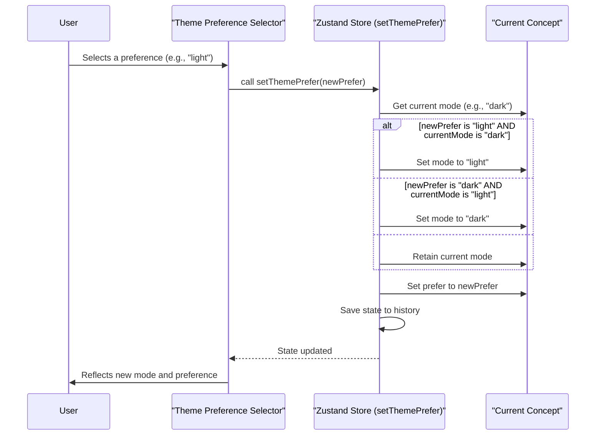

# Theme Mode and Preference

This section explains how to manage the visual theme mode (light or dark) and configure the overall theme preference within the Theme Builder. Understanding these settings is crucial for providing flexible and user-friendly experiences, allowing applications to adapt to user preferences or system settings. This builds upon the foundational understanding of [Theme Concepts](./core-concepts-theme-concepts.md) and [Theme Options Structure](./core-concepts-theme-options-structure.md).

## Understanding Theme Modes: Light and Dark

The Theme Builder supports distinct `light` and `dark` modes, allowing you to define different visual styles for various lighting conditions or user preferences. These modes are managed per `Concept` and can be switched dynamically.

### Switching Theme Modes

You can programmatically switch the active theme mode for the current concept using the `setThemeMode` method. This method updates the `mode` property of the `currentConcept`.

```typescript
setThemeMode: (mode: Mode, options?: { root?: boolean }) => void;
```

**Parameters**

| Name | Type | Description |
|---|---|---|
| `mode` | `"light" \| "dark"` | The desired theme mode to set. |
| `options.root` | `boolean` | Optional. If `true`, sets a global theme mode that overrides the concept's mode. Default is `false`. |

**Example**

```typescript
import { useThemeBuilder } from 'src/context/themeBuilder';

function ThemeModeSwitcher() {
  const setThemeMode = useThemeBuilder((s) => s.setThemeMode);

  const handleToggleMode = (newMode: 'light' | 'dark') => {
    setThemeMode(newMode);
  };

  return (
    <div>
      <button onClick={() => handleToggleMode('light')}>Set Light Mode</button>
      <button onClick={() => handleToggleMode('dark')}>Set Dark Mode</button>
    </div>
  );
}
```

This example demonstrates how to toggle between light and dark modes for the currently active theme concept. In the UI, this functionality is often exposed via toggle buttons, as seen in the `ColorsSection`:


### Retrieving the Current Theme Mode

The `getThemeMode` method allows you to retrieve the currently active theme mode. It prioritizes a globally set `themeMode` (if `options.root` was used in `setThemeMode`) over the current concept's mode.

```typescript
getThemeMode: () => Mode;
```

**Example**

```typescript
import { useThemeBuilder } from 'src/context/themeBuilder';

function CurrentModeDisplay() {
  const currentMode = useThemeBuilder((s) => s.getThemeMode());
  return <p>Current Theme Mode: {currentMode}</p>;
}
```

### Determining Theme Mode Visibility

The `shouldShowThemeMode` method helps determine if the theme mode switchers should be visible in the UI. It returns `true` if a global `themeMode` is not explicitly set, implying that the concept-specific mode can be controlled.

```typescript
shouldShowThemeMode: () => boolean;
```

## Configuring Theme Preference: System, Light, or Dark

Beyond simply switching between light and dark modes, you can set a `prefer`ence for how the theme should behave, allowing for `system` preference, or forcing `light` or `dark` mode globally.

### Setting Theme Preference

The `setThemePrefer` method controls this preference. When a preference is set, it can automatically adjust the current `mode` if the preference disables the currently active mode.

```typescript
setThemePrefer: (prefer: ThemePrefer) => void;
```

**Parameters**

| Name | Type | Description |
|---|---|---|
| `prefer` | `"light" \| "dark" \| "system"` | The desired theme preference. |

**Preference Options**

| Value | Description |
|---|---|
| `system` | The theme will adapt to the user's system preference (e.g., operating system dark mode setting). This is the default. |
| `light` | The theme will always display in light mode, disabling the dark mode option. If the current mode is `dark` when this preference is set, the mode will automatically switch to `light`. |
| `dark` | The theme will always display in dark mode, disabling the light mode option. If the current mode is `light` when this preference is set, the mode will automatically switch to `dark`. |

**Example**

```typescript
import { useThemeBuilder } from 'src/context/themeBuilder';
import ThemeModeSelector from 'src/components/Editor/StylesSection/ThemeModeSelector'; // A UI component for selection

function ThemePreferenceSettings() {
  const concept = useThemeBuilder((s) => s.getCurrentConcept());
  const setThemePrefer = useThemeBuilder((s) => s.setThemePrefer);

  return (
    <ThemeModeSelector 
      value={concept.prefer} 
      onChange={(value) => setThemePrefer(value)} 
    />
  );
}
```

This preference setting is often found in general theme settings, as illustrated by the `ColorsSettingMenu` which includes options to set the `ThemePrefer` value:


### `setThemePrefer` Logic Flow

Here's how `setThemePrefer` manages the current theme mode based on the selected preference:



This flow ensures that if a user selects a preference that disallows the currently active mode, the mode is automatically adjusted to a compatible setting.

---

Understanding and configuring theme modes and preferences empowers you to create more dynamic and user-centric applications. For a deeper dive into how different theme options are structured and applied, refer to the [Theme Options Structure](./core-concepts-theme-options-structure.md) section. To continue exploring visual customizations, proceed to [Previewing and Samples](./previewing-samples.md) to see your changes in action.