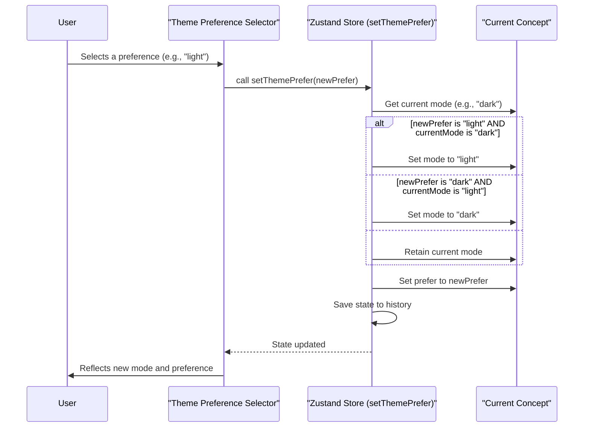

# 主题模式与偏好设置

本节将解释如何管理视觉主题模式（亮色或深色）以及如何在主题构建器中配置整体主题偏好。理解这些设置对于提供灵活且用户友好的体验至关重要，它允许应用程序适应用户偏好或系统设置。这建立在对[主题概念](./core-concepts-theme-concepts.md)和[主题选项结构](./core-concepts-theme-options-structure.md)的基本理解之上。

## 理解主题模式：亮色与深色

主题构建器支持独特的`light`（亮色）和`dark`（深色）模式，允许您为不同的光照条件或用户偏好定义不同的视觉样式。这些模式按`Concept`管理，并可以动态切换。

### 切换主题模式

您可以使用`setThemeMode`方法以编程方式切换当前概念的活动主题模式。此方法会更新`currentConcept`的`mode`属性。

```typescript
setThemeMode: (mode: Mode, options?: { root?: boolean }) => void;
```

**参数**

| Name | Type | Description |
|---|---|---|
| `mode` | `"light" \| "dark"` | 要设置的目标主题模式。 |
| `options.root` | `boolean` | 可选。如果为`true`，则设置一个全局主题模式，该模式会覆盖概念的模式。默认为`false`。 |

**示例**

```typescript
import { useThemeBuilder } from 'src/context/themeBuilder';

function ThemeModeSwitcher() {
  const setThemeMode = useThemeBuilder((s) => s.setThemeMode);

  const handleToggleMode = (newMode: 'light' | 'dark') => {
    setThemeMode(newMode);
  };

  return (
    <div>
      <button onClick={() => handleToggleMode('light')}>Set Light Mode</button>
      <button onClick={() => handleToggleMode('dark')}>Set Dark Mode</button>
    </div>
  );
}
```

此示例演示了如何为当前活动主题概念切换亮色和深色模式。在用户界面中，此功能通常通过切换按钮暴露出来，如`ColorsSection`中所示：


### 检索当前主题模式

`getThemeMode`方法允许您检索当前活动的主题模式。它优先于全局设置的`themeMode`（如果`options.root`在`setThemeMode`中使用）而不是当前概念的模式。

```typescript
getThemeMode: () => Mode;
```

**示例**

```typescript
import { useThemeBuilder } from 'src/context/themeBuilder';

function CurrentModeDisplay() {
  const currentMode = useThemeBuilder((s) => s.getThemeMode());
  return <p>Current Theme Mode: {currentMode}</p>;
}
```

### 确定主题模式可见性

`shouldShowThemeMode`方法有助于确定主题模式切换器是否应在用户界面中可见。如果未明确设置全局`themeMode`，则返回`true`，这意味着可以控制概念特定的模式。

```typescript
shouldShowThemeMode: () => boolean;
```

## 配置主题偏好：系统、亮色或深色

除了简单地在亮色和深色模式之间切换之外，您还可以为主题应如何表现设置一个`prefer`ence（偏好），允许`system`偏好，或全局强制`light`（亮色）或`dark`（深色）模式。

### 设置主题偏好

`setThemePrefer`方法控制此偏好。当设置了偏好时，如果该偏好禁用了当前活动模式，它会自动调整当前`mode`。

```typescript
setThemePrefer: (prefer: ThemePrefer) => void;
```

**参数**

| Name | Type | Description |
|---|---|---|
| `prefer` | `"light" \| "dark" \| "system"` | 期望的主题偏好。 |

**偏好选项**

| Value | Description |
|---|---|
| `system` | 主题将适应用户的系统偏好（例如，操作系统的深色模式设置）。这是默认值。 |
| `light` | 主题将始终显示为亮色模式，禁用深色模式选项。如果设置此偏好时当前模式为`dark`，则模式将自动切换为`light`。 |
| `dark` | 主题将始终显示为深色模式，禁用亮色模式选项。如果设置此偏好时当前模式为`light`，则模式将自动切换为`dark`。 |

**示例**

```typescript
import { useThemeBuilder } from 'src/context/themeBuilder';
import ThemeModeSelector from 'src/components/Editor/StylesSection/ThemeModeSelector'; // A UI component for selection

function ThemePreferenceSettings() {
  const concept = useThemeBuilder((s) => s.getCurrentConcept());
  const setThemePrefer = useThemeBuilder((s) => s.setThemePrefer);

  return (
    <ThemeModeSelector 
      value={concept.prefer} 
      onChange={(value) => setThemePrefer(value)} 
    />
  );
}
```

此偏好设置通常在通用主题设置中找到，如`ColorsSettingMenu`所示，它包含设置`ThemePrefer`值的选项：


### `setThemePrefer`逻辑流

以下是`setThemePrefer`如何根据所选偏好管理当前主题模式的：



此流程确保如果用户选择的偏好不允许当前活动模式，则模式会自动调整为兼容设置。

---

理解和配置主题模式及偏好，使您能够创建更具动态性和以用户为中心的应用程序。要更深入地了解不同主题选项的结构和应用，请参阅[主题选项结构](./core-concepts-theme-options-structure.md)部分。要继续探索视觉自定义，请前往[预览与示例](./previewing-samples.md)以查看您的更改效果。