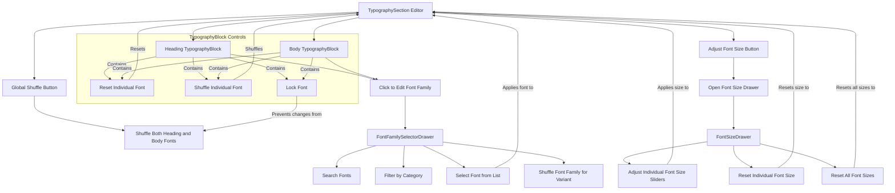

# Typography Customization

This section guides you through customizing the typography of your Material-UI theme using the Theme Builder. You will learn how to configure font families, including integrating Google Fonts, adjust text variants like headings and body text, set precise font sizes, and manage font locking for a consistent design system. For related visual adjustments, refer to the [Colors Customization](./customization-guides-colors.md) guide.

## The Typography Editor

The `TypographySection` component serves as the central interface for all typography-related adjustments. It provides a structured view of your theme's text styles and offers quick access to detailed customization tools.

### Layout and Controls

The `TypographySection` presents two main typography blocks: `heading` and `body`. These blocks allow you to quickly see and interact with your primary font choices. At the top right, a toolbar offers two key buttons:

*   **Adjust Font Size**: Marked by a `FormatSizeIcon`, this button opens a drawer for precise control over font sizes for all text variants.
*   **Shuffle**: This button allows you to instantly randomize the `heading` and `body` font families from a curated selection of Google Fonts, providing quick design inspiration.

Each typography block (`TypographyBlock`) also includes its own set of controls:

*   **Reset**: An `RestartAltIcon` allows you to revert the specific heading or body font family to its default setting.
*   **Shuffle**: A dedicated shuffle icon lets you randomize just the font family for that specific `heading` or `body` variant.
*   **Lock**: The `IconButtonLock` enables you to lock a font family, preventing it from being changed by global shuffle actions or predefined theme applications.

Here is a flowchart illustrating the interaction within the Typography Editor:

## Font Family Configuration

To change font families, you click on either the `heading` or `body` `TypographyBlock`, which opens the `FontFamilySelectorDrawer`. This drawer provides a comprehensive toolset for selecting and managing your fonts.

### Searching and Filtering Fonts

The drawer includes a search bar where you can type a query to find specific font families. Additionally, you can filter fonts by category using the provided cards:

| Category      | Description                                                                                             | Example Font                                  |
| :------------ | :------------------------------------------------------------------------------------------------------ | :-------------------------------------------- |
| Sans Serif    | Clean, modern fonts without decorative strokes at the end of letterforms, ideal for digital readability. | Arial, Helvetica, sans-serif                  |
| Serif         | Classic fonts with small decorative strokes (serifs) at the ends of letterforms, often used for print.    | Times New Roman, Times, serif                 |
| Display       | Decorative fonts designed for large sizes, often used for headlines or artistic purposes.                 | Impact, Chalkduster, fantasy, cursive         |
| Monospace     | Fonts where all characters occupy the same horizontal space, commonly used for code or data display.    | Fira Mono, Consolas, monospace                |

This categorization helps you narrow down choices from the extensive Google Fonts library, powered by the `useGoogleFonts` hook.

### Selecting and Applying Fonts

Once you've found a suitable font, you can click on it in the virtualized font list (`VirtualFontList`). This action immediately applies the selected font family to the chosen `variant` (heading or body) of your theme and closes the drawer. The `setFontOptions` function updates the theme's typography configuration accordingly.

### Shuffling Font Families

Within the `FontFamilySelectorDrawer`, a **Shuffle button** allows you to instantly randomize the font family for the currently selected `variant` (either heading or body). This provides a quick way to experiment with different font pairings and discover new design possibilities.

## Font Size Configuration

Clicking the "Adjust Font Size" button in the `TypographySection` toolbar opens the `FontSizeDrawer`. This drawer provides granular control over the pixel sizes of various text variants, from body text to all heading levels (`h1` through `h6`, `subtitle1`, `subtitle2`, and `overline`).

### Adjusting Individual Font Sizes

Each text variant (e.g., `body`, `h1`, `h2`) has its own dedicated slider. You can drag the slider to precisely adjust the font size within a range of `10px` to `64px`. As you move the slider, the displayed text next to it updates in real-time, showing the current pixel value. The changes are committed to your theme once you release the slider.

### Resetting Font Sizes

The `FontSizeDrawer` offers options to reset your font size customizations:

*   **Reset Individual Size**: Next to each variant's slider, a `RestartAltIcon` button allows you to revert that specific variant's font size to its default Material-UI value. This is useful for undoing changes to a single text style without affecting others.
*   **Reset All Sizes**: At the bottom of the drawer, a prominent "Reset All Sizes" button, also marked with a `RestartAltIcon`, reverts all font sizes (body and all headings) to their default Material-UI settings. This provides a clean slate for typography sizing.

## Font Locking

Font locking is a feature designed to preserve your chosen font families from unintentional changes when applying global shuffle actions or predefined themes. Each `TypographyBlock` (for heading and body) includes an `IconButtonLock`.

When you click this lock icon, the font family for that specific variant (`heading` or `body`) becomes locked. A locked font will not be affected when you use the global "Shuffle" button in the `TypographySection` toolbar or when you apply a new predefined theme. This ensures that your core typographic choices remain consistent while allowing you to experiment with other aspects of your theme.

To unlock a font, simply click the `IconButtonLock` again.

## Conclusion

Mastering typography customization with the Theme Builder allows you to define a consistent and visually appealing text hierarchy for your application. From selecting specific Google Fonts and adjusting precise sizes to utilizing the locking feature for design stability, these tools provide comprehensive control over your theme's textual elements.

For more information on adjusting other visual aspects of your theme, proceed to the [Styles Customization](./customization-guides-styles.md) guide.