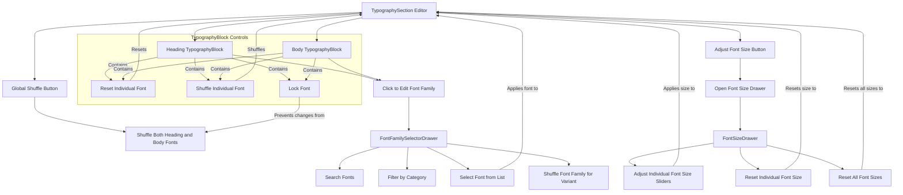

# 字体排版自定义

本节将指导您如何使用主题构建器（Theme Builder）自定义 Material-UI 主题的字体排版。您将学习如何配置字体系列（包括集成 Google Fonts）、调整标题和正文等文本变体、设置精确的字体大小以及管理字体锁定功能以实现一致的设计系统。有关相关的视觉调整，请参阅[颜色自定义](./customization-guides-colors.md)指南。

## 字体排版编辑器

`TypographySection` 组件是所有字体排版相关调整的中心界面。它提供了主题文本样式结构化视图，并可快速访问详细的自定义工具。

### 布局和控件

`TypographySection` 展示了两个主要的字体排版区块：`heading`（标题）和 `body`（正文）。这些区块让您能够快速查看和调整主要的字体选择。在右上角，工具栏提供了两个主要按钮：

*   **调整字体大小**：此按钮标有 `FormatSizeIcon` 图标，点击后会打开一个抽屉，用于精确控制所有文本变体的字体大小。
*   **随机排列**：此按钮可让您从精选的 Google Fonts 字体库中即时随机排列 `heading` 和 `body` 字体系列，从而提供快速设计灵感。

每个字体排版区块（`TypographyBlock`）也包含其自身的控件：

*   **重置**：一个 `RestartAltIcon` 图标允许您将特定标题或正文字体系列恢复到其默认设置。
*   **随机排列**：一个专门的随机排列图标允许您仅针对该特定的 `heading` 或 `body` 变体随机排列字体系列。
*   **锁定**：`IconButtonLock` 使您能够锁定一个字体系列，防止其因全局随机排列操作或预定义主题应用而更改。

这是说明字体排版编辑器内交互的流程图：

## 字体系列配置

要更改字体系列，您可以点击 `heading` 或 `body` 字体排版区块（`TypographyBlock`），这将打开 `FontFamilySelectorDrawer`。此抽屉提供了用于选择和管理字体的综合工具集。

### 搜索和筛选字体

抽屉中包含一个搜索栏，您可以在其中输入查询以查找特定的字体系列。此外，您可以使用提供的卡片按类别筛选字体：

| 类别      | 描述                                                                                             | 示例字体                                  |
| :------------ | :------------------------------------------------------------------------------------------------------ | :-------------------------------------------- |
| 无衬线字体    | 简洁、现代的字体，字符末端没有装饰性笔画，非常适合数字阅读。 | Arial, Helvetica, sans-serif                  |
| 衬线字体         | 经典的字体，字符末端带有小的装饰性笔画（衬线），常用于印刷。    | Times New Roman, Times, serif                 |
| 展示字体       | 为大尺寸设计、具有装饰性的字体，常用于标题或艺术用途。                 | Impact, Chalkduster, fantasy, cursive         |
| 等宽字体     | 所有字符占据相同水平空间的字体，常用于代码或数据展示。    | Fira Mono, Consolas, monospace                |

这种分类有助于您从庞大的 Google Fonts 字体库中缩小选择范围，该库由 `useGoogleFonts` 钩子提供支持。

### 选择和应用字体

找到合适的字体后，您可以在虚拟字体列表（`VirtualFontList`）中点击它。此操作会立即将选定的字体系列应用到主题中选择的 `variant`（标题或正文），并关闭抽屉。`setFontOptions` 函数会相应地更新主题的字体排版配置。

### 随机排列字体系列

在 `FontFamilySelectorDrawer` 中，一个**随机排列按钮**允许您即时随机排列当前选定 `variant`（标题或正文）的字体系列。这提供了一种快速方式来尝试不同的字体搭配并发现新的设计可能性。

## 字体大小配置

点击 `TypographySection` 工具栏中的“调整字体大小”按钮将打开 `FontSizeDrawer`。此抽屉提供了对各种文本变体（从正文到所有标题级别，即 `h1` 到 `h6`、`subtitle1`、`subtitle2` 和 `overline`）像素大小的精细控制。

### 调整单个字体大小

每个文本变体（例如 `body`、`h1`、`h2`）都有其专属的滑块。您可以拖动滑块，在 `10px` 到 `64px` 的范围内精确调整字体大小。当您移动滑块时，旁边显示的文本会实时更新，显示当前的像素值。释放滑块后，更改将提交到您的主题。

### 重置字体大小

`FontSizeDrawer` 提供了重置字体大小自定义的选项：

*   **重置单个大小**：在每个变体滑块旁边，有一个 `RestartAltIcon` 按钮，允许您将该特定变体的字体大小恢复到其默认的 Material-UI 值。这对于撤销单个文本样式的更改而不影响其他样式非常有用。
*   **重置所有大小**：在抽屉底部，一个醒目的“重置所有大小”按钮（同样标有 `RestartAltIcon` 图标）会将所有字体大小（正文和所有标题）恢复到其默认的 Material-UI 设置。这为字体排版大小提供了全新的起点。

## 字体锁定

字体锁定是一项旨在在应用全局随机排列操作或预定义主题时，保护您选择的字体系列不被意外更改的功能。每个字体排版区块（`TypographyBlock`）（用于标题和正文）都包含一个 `IconButtonLock`。

当您点击此锁定图标时，该特定变体（`heading` 或 `body`）的字体系列将被锁定。当您使用 `TypographySection` 工具栏中的全局“随机排列”按钮或应用新的预定义主题时，锁定的字体将不会受到影响。这确保了您的核心字体排版选择保持一致，同时允许您尝试主题的其他方面。

要解锁字体，只需再次点击 `IconButtonLock`。

## 结论

掌握使用主题构建器进行字体排版自定义，可以帮助您的应用程序定义一致且具有视觉吸引力的文本层次结构。从选择特定的 Google Fonts 并调整精确大小，到利用锁定功能确保设计稳定性，这些工具为您的主题文本元素提供了全面的控制。

有关调整主题其他视觉方面的更多信息，请参阅[样式自定义](./customization-guides-styles.md)指南。