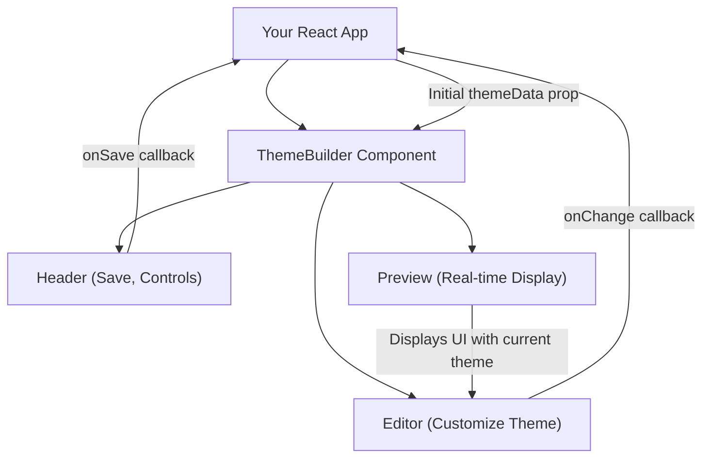

# Getting Started

This section guides you through integrating and running the Theme Builder component in your React applications. You will learn how to install the necessary package and see a minimal usage example to get started quickly.

For an overall understanding of the Theme Builder's capabilities, refer to the [Overview](./overview.md). For detailed information on the component's API, see the [Components](./api-reference-components.md) section in the API Reference.

## Installation

To begin, you need to install the `@blocklet/theme-builder-react` package. You can do this using npm or yarn:

```bash
npm install @blocklet/theme-builder-react
# or
yarn add @blocklet/theme-builder-react
```

## Basic Usage

Once installed, you can integrate the `ThemeBuilder` component into your React application. The following example demonstrates a basic setup, including enabling the preview window and handling theme data.

```tsx
import { ThemeBuilder, ThemeData } from '@blocklet/theme-builder-react';
import { useState } from 'react';

function App() {
  const [themeData, setThemeData] = useState<ThemeData | undefined>(undefined);

  // This function simulates saving theme data, for example, to a backend.
  // In a real application, you would implement actual data persistence here.
  const handleSave = async (data: ThemeData) => {
    console.log('Theme data to save:', data);
    setThemeData(data);
    // Simulate API call
    await new Promise(resolve => setTimeout(resolve, 500));
    alert('Theme saved successfully!');
  };

  // This function is called whenever theme data changes within the builder.
  const handleChange = (data: ThemeData) => {
    console.log('Theme data changed:', data);
    // You can update local state or perform other actions here.
  };

  return (
    <div style={{ height: '100vh', width: '100vw' }}>
      <ThemeBuilder
        showPreview={true} // Display the preview window
        locale="en" // Set the locale to English
        themeData={themeData} // Initial theme data (optional)
        fetchTheme={false} // Disable automatic theme fetching from a service
        onSave={handleSave} // Callback for saving theme data
        onChange={handleChange} // Callback for theme data changes
      />
    </div>
  );
}

export default App;
```

This example sets up a `ThemeBuilder` instance with a real-time preview. It includes state management for `themeData` and demonstrates how to handle `onSave` and `onChange` callbacks. `fetchTheme={false}` is set to prevent the component from automatically trying to load theme data from a backend service, which is suitable for a quick local setup.

### Key Props

Here are some essential props for the `ThemeBuilder` component:

| Name | Type | Description |
|---|---|---|
| `loading` | `boolean` | If `true`, a loading overlay is displayed over the builder. |
| `showPreview` | `boolean` | If `true`, the real-time preview window is displayed. |
| `showEditor` | `boolean` | If `true`, the theme editor panel is displayed. |
| `showHeader` | `boolean` | If `true`, the component header (with save, undo/redo, etc.) is displayed. |
| `themeMode` | `Mode` | Controls the theme color mode (`'light'` or `'dark'`). Overrides internal state if provided. |
| `locale` | `Locale` | Sets the language for the Theme Builder UI (e.g., `'en'`, `'zh'`). |
| `themeOptions` | `ThemeOptions` | Material-UI `ThemeOptions` to be deeply merged with the builder's default theme, allowing custom overrides. |
| `themeData` | `ThemeData \| null` | Initial `ThemeData` to load into the builder. If `fetchTheme` is not `false`, this will be overridden by fetched data. |
| `onSave` | `(themeData: ThemeData, defaultSave: DefaultSave) => Promise<void>` | Callback function triggered when the user initiates a save action. Provides the current `ThemeData` and a default save function. |
| `onChange` | `(themeData: ThemeData) => void` | Callback function triggered whenever the theme data changes within the editor. |
| `fetchTheme` | `false \| ((defaultFetch: DefaultFetch) => Promise<ThemeData \| null>)` | Controls whether theme data is automatically fetched from a service. Set to `false` to disable. Can also be a custom fetch function. |

## How it Works

The `ThemeBuilder` component integrates several key features to provide a comprehensive theme customization experience. The diagram below illustrates its basic architecture:



When you interact with the editor, changes are immediately reflected in the preview window. The `onChange` callback keeps your application informed of real-time theme data changes, while the `onSave` callback allows you to persist the final theme configuration.

## Next Steps

You have successfully integrated the Theme Builder into your application. To understand the underlying data models and state management, proceed to the [Core Concepts](./core-concepts.md) section. If you are ready to explore the component's full API, refer to the [API Reference](./api-reference.md).