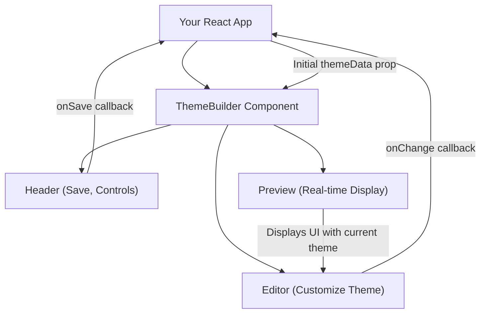

# 快速开始

本节将指导您如何在 React 应用程序中集成并运行 Theme Builder 组件。您将了解如何安装必要的包，并查看一个最简用法示例以快速上手。

要全面了解 Theme Builder 的功能，请参阅[概述](./overview.md)。有关组件 API 的详细信息，请参阅 API 参考中的[组件](./api-reference-components.md)部分。

## 安装

首先，您需要安装 `@blocklet/theme-builder-react` 包。您可以使用 npm 或 yarn 来安装：

```bash
npm install @blocklet/theme-builder-react
# or
yarn add @blocklet/theme-builder-react
```

## 基本用法

安装完成后，您可以将 `ThemeBuilder` 组件集成到您的 React 应用程序中。以下示例演示了基本设置，包括启用预览窗口和处理主题数据。

```tsx
import { ThemeBuilder, ThemeData } from '@blocklet/theme-builder-react';
import { useState } from 'react';

function App() {
  const [themeData, setThemeData] = useState<ThemeData | undefined>(undefined);

  // This function simulates saving theme data, for example, to a backend.
  // In a real application, you would implement actual data persistence here.
  const handleSave = async (data: ThemeData) => {
    console.log('Theme data to save:', data);
    setThemeData(data);
    // Simulate API call
    await new Promise(resolve => setTimeout(resolve, 500));
    alert('Theme saved successfully!');
  };

  // This function is called whenever theme data changes within the builder.
  const handleChange = (data: ThemeData) => {
    console.log('Theme data changed:', data);
    // You can update local state or perform other actions here.
  };

  return (
    <div style={{ height: '100vh', width: '100vw' }}>
      <ThemeBuilder
        showPreview={true} // Display the preview window
        locale="en" // Set the locale to English
        themeData={themeData} // Initial theme data (optional)
        fetchTheme={false} // Disable automatic theme fetching from a service
        onSave={handleSave} // Callback for saving theme data
        onChange={handleChange} // Callback for theme data changes
      />
    </div>
  );
}

export default App;
```

此示例设置了一个带有实时预览的 `ThemeBuilder` 实例。它包括 `themeData` 的状态管理，并演示了如何处理 `onSave` 和 `onChange` 回调。设置 `fetchTheme={false}` 以防止组件自动尝试从后端服务加载主题数据，这适用于快速本地设置。

### 关键属性

以下是 `ThemeBuilder` 组件的一些关键属性：

| Name | Type | Description |
|---|---|---|
| `loading` | `boolean` | 如果为 `true`，则在构建器上方显示加载叠加层。 |
| `showPreview` | `boolean` | 如果为 `true`，则显示实时预览窗口。 |
| `showEditor` | `boolean` | 如果为 `true`，则显示主题编辑器面板。 |
| `showHeader` | `boolean` | 如果为 `true`，则显示组件标题（带保存、撤消/重做等）。 |
| `themeMode` | `Mode` | 控制主题颜色模式（`'light'` 或 `'dark'`）。如果提供，将覆盖内部状态。 |
| `locale` | `Locale` | 设置 Theme Builder UI 的语言（例如，`'en'`、`'zh'`）。 |
| `themeOptions` | `ThemeOptions` | Material-UI `ThemeOptions`，将与构建器的默认主题进行深度合并，允许自定义覆盖。 |
| `themeData` | `ThemeData \| null` | 要加载到构建器中的初始 `ThemeData`。如果 `fetchTheme` 不为 `false`，此值将被获取的数据覆盖。 |
| `onSave` | `(themeData: ThemeData, defaultSave: DefaultSave) => Promise<void>` | 当用户发起保存操作时触发的回调函数。提供当前 `ThemeData` 和一个默认保存函数。 |
| `onChange` | `(themeData: ThemeData) => void` | 当编辑器中的主题数据发生变化时触发的回调函数。 |
| `fetchTheme` | `false \| ((defaultFetch: DefaultFetch) => Promise<ThemeData \| null>)` | 控制是否从服务自动获取主题数据。设置为 `false` 禁用。也可以是自定义获取函数。 |

## 工作原理

`ThemeBuilder` 组件集成了多项关键功能，以提供全面的主题定制体验。下图展示了其基本架构：



当您与编辑器交互时，更改会立即反映在预览窗口中。`onChange` 回调使您的应用程序能够了解实时主题数据更改，而 `onSave` 回调允许您持久化最终主题配置。

## 下一步

您已成功将 Theme Builder 集成到您的应用程序中。要了解底层数据模型和状态管理，请继续阅读 [核心概念](./core-concepts.md) 部分。如果您准备探索组件的完整 API，请参阅 [API 参考](./api-reference.md)。
