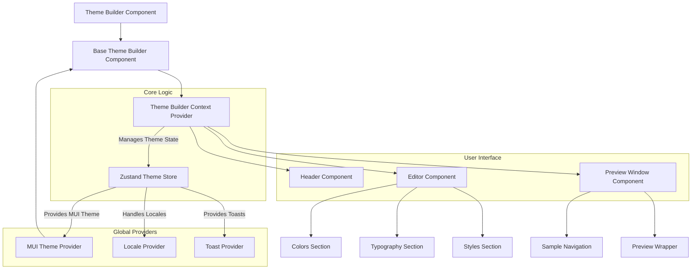

# Overview
The Theme Builder React component offers a comprehensive solution for customizing and managing Material-UI themes within your React applications. It provides a visual interface for developers to modify various aspects of a theme, along with real-time preview capabilities.

This section introduces the Theme Builder's purpose, its core functionalities, and an overview of its architecture. For details on integrating the component, refer to [Getting Started](./getting-started.md). For a comprehensive breakdown of its components, hooks, and types, consult the [API Reference](./api-reference.md).

## Core Capabilities
The Theme Builder simplifies the process of creating and refining design systems by offering several key capabilities:

*   **Visual Customization**: Directly modify theme properties such as colors, typography, and general styles through an intuitive editor. This includes setting primary, secondary, and other palette colors, configuring font families and text variants, and adjusting border radius or other stylistic elements.
*   **Theme Management**: Create, manage, and switch between multiple theme concepts, allowing you to iterate on different design ideas or maintain variations (e.g., product themes, brand themes). It supports dynamic switching between light and dark modes and setting system-wide theme preferences.
*   **Real-time Preview**: Instantly visualize changes in a dedicated preview window. The preview supports different device sizes and can display pre-built UI samples or even live Blocklet applications, ensuring your theme looks consistent across various contexts.
*   **History Management**: Utilize built-in undo and redo functionalities to experiment freely with theme changes without fear of losing previous iterations. The builder also supports saving and loading theme data, facilitating collaboration and persistence.

## Architecture Overview
The Theme Builder component is built upon a robust architecture designed for flexibility and ease of use. At its core, it leverages the [Zustand](https://zustand-bear.github.io/zustand/docs/introduction) state management library to manage all theme-related data and interactions. The `ThemeBuilderContext.Provider` wraps the application, making the theme store accessible to all child components.

This setup ensures that components like the `Editor` (where you make changes) and the `PreviewWindow` (where you see results) can efficiently consume and update the theme state. The Material-UI `ThemeProvider` then uses this real-time theme data to render components with the applied styles.

## Conclusion
The Theme Builder provides a streamlined workflow for Material-UI theme customization, enabling developers to quickly prototype, apply, and manage design changes. Its visual editor and real-time feedback mechanisms enhance the theming experience, making it more efficient and less error-prone.

To begin using the Theme Builder in your project, proceed to the [Getting Started](./getting-started.md) guide.