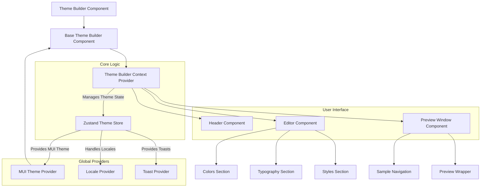

# 概述
Theme Builder React 组件为在您的 React 应用程序中定制和管理 Material-UI 主题提供了全面的解决方案。它为开发者提供了一个可视化界面，用于修改主题的各个方面，并具备实时预览功能。

本节介绍了 Theme Builder 的用途、其核心功能以及其架构概述。有关集成该组件的详细信息，请参阅[入门](./getting-started.md)。有关其组件、Hook 和类型的全面细分，请查阅[API 参考](./api-reference.md)。

## 核心功能
Theme Builder 通过提供以下几项关键功能，简化了创建和优化设计系统的过程：

*   **可视化定制**：通过直观的编辑器直接修改主题属性，如颜色、排版和通用样式。这包括设置主色、辅色和其他调色板颜色，配置字体家族和文本变体，以及调整边框半径或其他样式元素。
*   **主题管理**：创建、管理和切换多个主题概念，允许您迭代不同的设计想法或维护变体（例如，产品主题、品牌主题）。它支持在浅色模式和深色模式之间动态切换，并设置系统范围的主题偏好设置。
*   **实时预览**：在专用预览窗口中即时可视化更改。预览支持不同的设备尺寸，可以显示预构建的 UI 样本甚至实时 Blocklet 应用程序，确保您的主题在各种上下文中看起来一致。
*   **历史管理**：利用内置的撤消和重做功能，自由尝试主题更改，而不必担心丢失之前的迭代。该构建器还支持保存和加载主题数据，便于协作和持久化。

## 架构概述
Theme Builder 组件建立在为灵活性和易用性而设计的强大架构之上。其核心是利用 [Zustand](https://zustand-bear.github.io/zustand/docs/introduction) 状态管理库来管理所有与主题相关的数据和交互。`ThemeBuilderContext.Provider` 包裹着应用程序，使主题存储对所有子组件都可访问。

这种设置确保了像 `Editor`（您进行更改的地方）和 `PreviewWindow`（您查看结果的地方）这样的组件可以有效地消费和更新主题状态。然后，Material-UI `ThemeProvider` 使用这些实时主题数据来渲染应用了样式的组件。

## 结论
Theme Builder 为 Material-UI 主题定制提供了简化的工作流程，使开发者能够快速原型设计、应用和管理设计更改。其可视化编辑器和实时反馈机制增强了主题设置体验，使其更高效且不易出错。

要在您的项目中开始使用 Theme Builder，请前往[入门](./getting-started.md)指南。