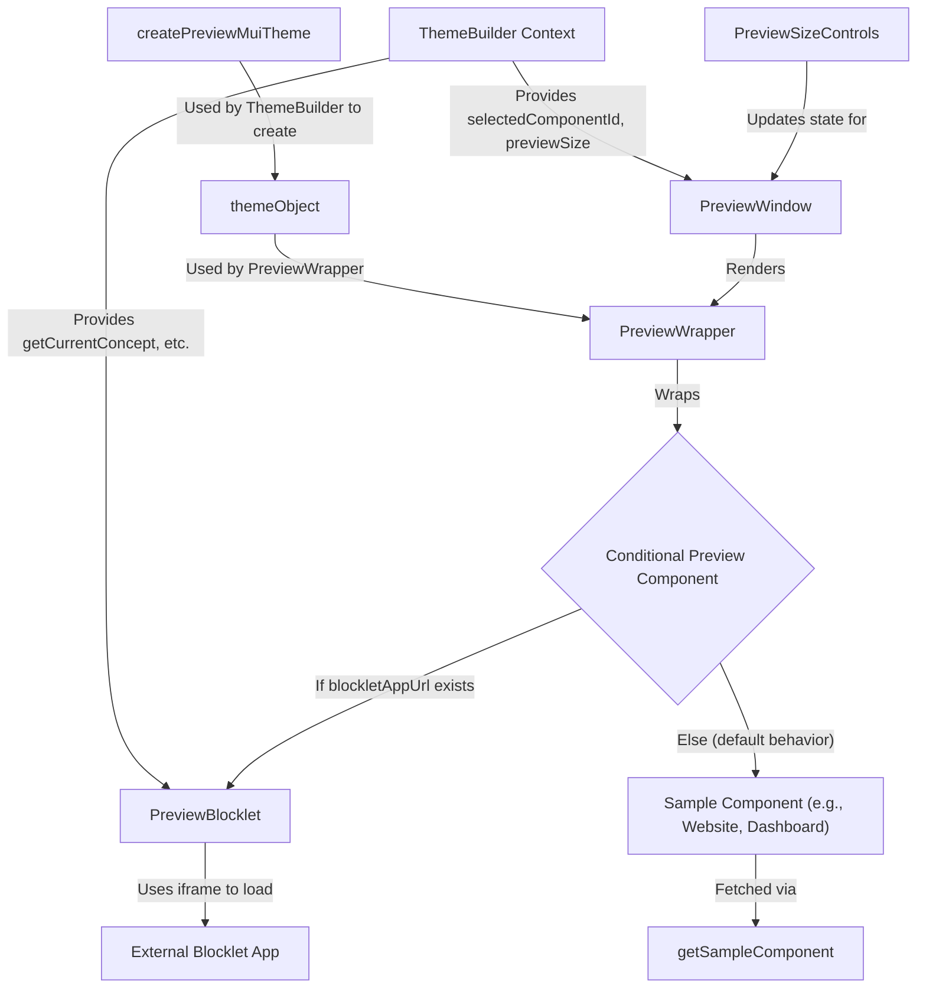

# Previewing and Samples

This section guides you through utilizing the Theme Builder's real-time preview window. You will learn how to visualize theme changes across different device sizes and explore pre-built UI samples, ensuring your designs adapt seamlessly to various contexts.

## Real-time Preview Functionality

The Theme Builder includes a dynamic preview window that instantly reflects your theme modifications. This feature is powered primarily by the `PreviewWindow` component, which intelligently manages content display, responsiveness, and integration with external Blocklet applications.

### Overview of `PreviewWindow`

The `PreviewWindow` component serves as the primary container for displaying your themed content. It dynamically renders either a pre-built UI sample or a live Blocklet application, wrapped within a `PreviewWrapper` for consistent styling and theme application. A `SampleNavigation` component is also displayed for easy switching between pre-built samples when a Blocklet URL is not provided.

```tsx
function PreviewWindow() {
  // ... (state and ref declarations)

  // If appUrl exists, enable real-time Blocklet preview
  const previewComponent = blockletAppUrl ? <PreviewBlocklet appUrl={blockletAppUrl} /> : sampleComponent;

  return (
    <Box
      ref={containerRef}
      className="preview-window"
      sx={{
        padding: 2,
        position: 'relative',
      }}>
      {/* Samples navigation */}
      {!blockletAppUrl && (
        <Box sx={{ display: 'flex', justifyContent: 'center', mb: 1 }}>
          <SampleNavigation />
        </Box>
      )}
      <PreviewWrapper
        sx={{
          width: shouldScale ? PC_PREVIEW_WINDOW_MIN_WIDTH : '100%',
          transform: shouldScale ? `scale(${scale})` : 'none',
          transformOrigin: 'top left',
        }}>
        {previewComponent || null}
      </PreviewWrapper>
    </Box>
  );
}

export default PreviewWindow;
```

### Handling Responsive Layouts and Scaling

The `PreviewWindow` actively monitors its own container width and applies scaling if the content needs to be displayed in a smaller space than its intended minimum width. This ensures that even when the Theme Builder UI is resized, the preview remains fully visible and accurately scaled. The `PC_PREVIEW_WINDOW_MIN_WIDTH` constant (960 pixels) defines the minimum width before scaling is applied.

When the `previewSize` is set to `false` (indicating a desktop view) and the container width falls below this minimum, the content is scaled down to fit, maintaining its aspect ratio.

### Live Blocklet Preview

For real-time previews of Blocklet applications, the `PreviewWindow` conditionally renders the `PreviewBlocklet` component. This component embeds the Blocklet application within an iframe and facilitates communication to apply theme configurations dynamically.

**Mechanism for Theme Application in `PreviewBlocklet`:**

The `PreviewBlocklet` component communicates theme updates to the embedded Blocklet application via `postMessage`. When a theme property is changed in the Theme Builder, the `THEME_BUILDER_CONFIG_CHANGED` event is sent to the iframe, allowing the Blocklet app to consume and apply the new theme configurations instantly. The iframe also dynamically adjusts its height to match the content of the embedded application, preventing scrollbars within the iframe itself.

```tsx
export function PreviewBlocklet({ appUrl }: PreviewBlockletProps) {
  const iframeRef = useRef<HTMLIFrameElement>(null);
  const concept = useThemeBuilder((s) => s.getCurrentConcept());
  const iframeLoaded = useRef(false);

  // Send theme configuration to iframe
  const sendConcept = useMemoizedFn(() => {
    if (iframeLoaded.current) {
      iframeRef.current?.contentWindow?.postMessage({
        type: 'THEME_BUILDER_CONFIG_CHANGED',
        payload: {
          mode: concept.mode,
          ...concept.themeConfig,
        },
      });
    }
  });

  // ... (iframe load and resize handling)

  // Update theme when concept changes
  useEffect(() => {
    sendConcept();
  }, [concept, sendConcept]);

  return (
    <iframe
      title="blocklet preview"
      ref={iframeRef}
      src={appUrl}
      style={{
        border: 0,
        width: '100%',
        height: `${MIN_HEIGHT}px`,
        display: 'block',
      }}
      onLoad={onIframeLoad}
    />
  );
}
```

### Component Flow for Preview

The following diagram illustrates how the different components interact to provide the preview functionality:



## Controlling Preview Device Sizes

To ensure your theme looks good on various devices, the Theme Builder allows you to simulate different screen sizes within the preview window. This functionality is managed by the `PreviewSizeControls` component.

### `PreviewSizeControls` Component

Located in the header, the `PreviewSizeControls` component provides buttons to switch between desktop, tablet, and mobile preview modes. On actual mobile or tablet devices, these controls are automatically hidden, and the preview size adapts to the device's viewport.

```tsx
function PreviewSizeControls() {
  const previewSize = useThemeBuilder((s) => s.previewSize);
  const setPreviewSize = useThemeBuilder((s) => s.setPreviewSize);
  const handleOnChange = useCallback((_: unknown, value: PreviewSize) => setPreviewSize(value), [setPreviewSize]);

  const theme = useTheme();
  const isMobile = useMediaQuery(theme.breakpoints.down('sm'));
  const isTablet = useMediaQuery(theme.breakpoints.between('sm', 'md'));

  // ... (useEffect for initial size setting)

  return isMobile || isTablet ? null : (
    <BottomNavigation
      id={previewSizeControlsId}
      value={previewSize}
      onChange={handleOnChange}
      // ... (styles)
      showLabels>
      <BottomNavigationAction sx={{ p: 1, minWidth: '32px' }} value="xs" icon={<SmartphoneIcon />} />
      <BottomNavigationAction sx={{ p: 1, minWidth: '32px' }} value="sm" icon={<TabletMacIcon />} />
      <BottomNavigationAction sx={{ p: 1, minWidth: '32px' }} value={false} icon={<LaptopMacIcon />} />
    </BottomNavigation>
  );
}
```

### How `previewSize` Influences Rendering

When you select a preview size (`xs` for mobile, `sm` for tablet, or `false` for desktop), the `setPreviewSize` action in the theme store is triggered. This updates the global `previewSize` state. Internally, the `createPreviewMuiTheme` utility function utilizes Material-UI's `breakpoints` to enforce the selected device size. It does this by overriding the default breakpoint values to effectively limit the rendering width, simulating the dimensions of a mobile (`xs`) or tablet (`sm`) device, ensuring precise visual representation.

--- 

This section has provided a comprehensive overview of the Theme Builder's preview capabilities, including real-time visualization, responsive handling, live Blocklet integration, and device size simulation. You are now equipped to effectively preview and validate your theme designs across various contexts. For detailed information on the underlying components, hooks, and types that power these functionalities, proceed to the [API Reference](./api-reference.md) section.