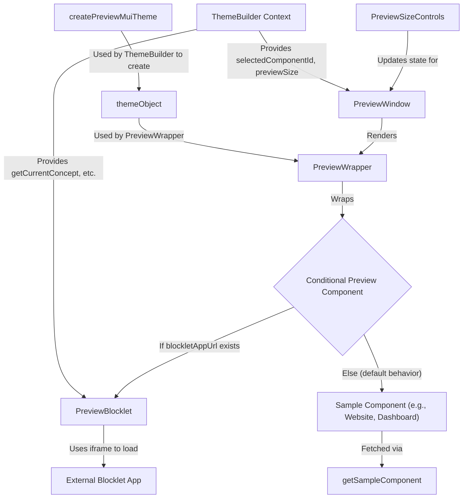

# 预览与示例

本节将引导您如何利用主题构建器的实时预览窗口。您将了解如何在不同设备尺寸下可视化主题更改，并探索预构建的 UI 示例，确保您的设计能够无缝适应各种场景。

## 实时预览功能

主题构建器包含一个动态预览窗口，可即时反映您的主题修改。此功能主要由 `PreviewWindow` 组件提供支持，该组件智能地管理内容显示、响应能力以及与外部 Blocklet 应用程序的集成。

### `PreviewWindow` 概述

`PreviewWindow` 组件是显示主题内容的 主要容器。它动态渲染预构建的 UI 示例或实时的 Blocklet 应用程序，并将其包装在 `PreviewWrapper` 中，以实现一致的样式和主题应用。当未提供 Blocklet URL 时，还会显示一个 `SampleNavigation` 组件，以便于在预构建示例之间轻松切换。

```tsx
function PreviewWindow() {
  // ... (state and ref declarations)

  // If appUrl exists, enable real-time Blocklet preview
  const previewComponent = blockletAppUrl ? <PreviewBlocklet appUrl={blockletAppUrl} /> : sampleComponent;

  return (
    <Box
      ref={containerRef}
      className="preview-window"
      sx={{
        padding: 2,
        position: 'relative',
      }}>
      {/* Samples navigation */}
      {!blockletAppUrl && (
        <Box sx={{ display: 'flex', justifyContent: 'center', mb: 1 }}>
          <SampleNavigation />
        </Box>
      )}
      <PreviewWrapper
        sx={{
          width: shouldScale ? PC_PREVIEW_WINDOW_MIN_WIDTH : '100%',
          transform: shouldScale ? `scale(${scale})` : 'none',
          transformOrigin: 'top left',
        }}>
        {previewComponent || null}
      </PreviewWrapper>
    </Box>
  );
}

export default PreviewWindow;
```

### 处理响应式布局与缩放

`PreviewWindow` 会主动监控其容器宽度，并在内容需要以小于其预期最小宽度的空间显示时应用缩放。这确保了即使主题构建器 UI 被调整大小，预览也保持完全可见且准确缩放。`PC_PREVIEW_WINDOW_MIN_WIDTH` 常量（960 像素）定义了应用缩放前的最小宽度。

当 `previewSize` 设置为 `false`（表示桌面视图）且容器宽度低于此最小值时，内容会按比例缩小以适应，同时保持其纵横比。

### 实时 Blocklet 预览

对于 Blocklet 应用程序的实时预览，`PreviewWindow` 有条件地渲染 `PreviewBlocklet` 组件。此组件将 Blocklet 应用程序嵌入到 iframe 中，并促进通信以动态应用主题配置。

**`PreviewBlocklet` 中主题应用的机制：**

`PreviewBlocklet` 组件通过 `postMessage` 将主题更新传达给嵌入的 Blocklet 应用程序。当主题构建器中更改主题属性时，`THEME_BUILDER_CONFIG_CHANGED` 事件会发送到 iframe，允许 Blocklet 应用程序即时使用和应用新的主题配置。iframe 还会动态调整其高度以匹配嵌入应用程序的内容，防止 iframe 内部出现滚动条。

```tsx
export function PreviewBlocklet({ appUrl }: PreviewBlockletProps) {
  const iframeRef = useRef<HTMLIFrameElement>(null);
  const concept = useThemeBuilder((s) => s.getCurrentConcept());
  const iframeLoaded = useRef(false);

  // Send theme configuration to iframe
  const sendConcept = useMemoizedFn(() => {
    if (iframeLoaded.current) {
      iframeRef.current?.contentWindow?.postMessage({
        type: 'THEME_BUILDER_CONFIG_CHANGED',
        payload: {
          mode: concept.mode,
          ...concept.themeConfig,
        },
      });
    }
  });

  // ... (iframe load and resize handling)

  // Update theme when concept changes
  useEffect(() => {
    sendConcept();
  }, [concept, sendConcept]);

  return (
    <iframe
      title="blocklet preview"
      ref={iframeRef}
      src={appUrl}
      style={{
        border: 0,
        width: '100%',
        height: `${MIN_HEIGHT}px`,
        display: 'block',
      }}
      onLoad={onIframeLoad}
    />
  );
}
```

### 预览组件流程

下图说明了不同组件如何交互以提供预览功能：



## 控制预览设备尺寸

为了确保您的主题在各种设备上都能良好显示，主题构建器允许您在预览窗口中模拟不同的屏幕尺寸。此功能由 `PreviewSizeControls` 组件管理。

### `PreviewSizeControls` 组件

`PreviewSizeControls` 组件位于标题中，提供用于在桌面、平板电脑和移动预览模式之间切换的按钮。在实际的移动或平板电脑设备上，这些控件会自动隐藏，并且预览尺寸会根据设备的视口进行调整。

```tsx
function PreviewSizeControls() {
  const previewSize = useThemeBuilder((s) => s.previewSize);
  const setPreviewSize = useThemeBuilder((s) => s.setPreviewSize);
  const handleOnChange = useCallback((_: unknown, value: PreviewSize) => setPreviewSize(value), [setPreviewSize]);

  const theme = useTheme();
  const isMobile = useMediaQuery(theme.breakpoints.down('sm'));
  const isTablet = useMediaQuery(theme.breakpoints.between('sm', 'md'));

  // ... (useEffect for initial size setting)

  return isMobile || isTablet ? null : (
    <BottomNavigation
      id={previewSizeControlsId}
      value={previewSize}
      onChange={handleOnChange}
      // ... (styles)
      showLabels>
      <BottomNavigationAction sx={{ p: 1, minWidth: '32px' }} value="xs" icon={<SmartphoneIcon />} />
      <BottomNavigationAction sx={{ p: 1, minWidth: '32px' }} value="sm" icon={<TabletMacIcon />} />
      <BottomNavigationAction sx={{ p: 1, minWidth: '32px' }} value={false} icon={<LaptopMacIcon />} />
    </BottomNavigation>
  );
}
```

### `previewSize` 如何影响渲染

当您选择预览尺寸（`xs` 用于移动设备，`sm` 用于平板电脑，或 `false` 用于桌面）时，主题存储中的 `setPreviewSize` 操作会被触发。这会更新全局 `previewSize` 状态。在内部，`createPreviewMuiTheme` 实用函数利用 Material-UI 的 `breakpoints` 来强制执行所选设备尺寸。它通过覆盖默认的断点值来实现这一点，从而有效地限制渲染宽度，模拟移动设备（`xs`）或平板电脑（`sm`）的尺寸，确保精确的视觉呈现。

---

本节全面概述了主题构建器的预览功能，包括实时可视化、响应式处理、实时 Blocklet 集成和设备尺寸模拟。您现在已能有效预览和验证跨各种场景的主题设计。有关支持这些功能的基础组件、钩子和类型的详细信息，请继续阅读[API 参考](./api-reference.md)部分。